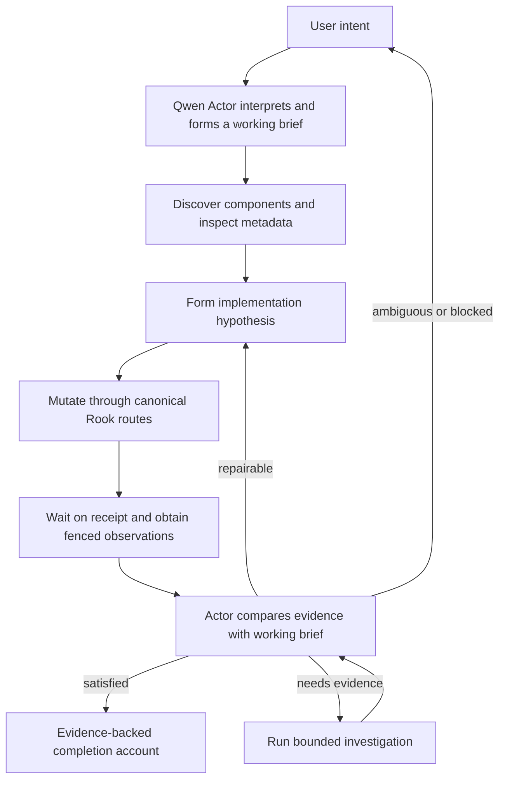
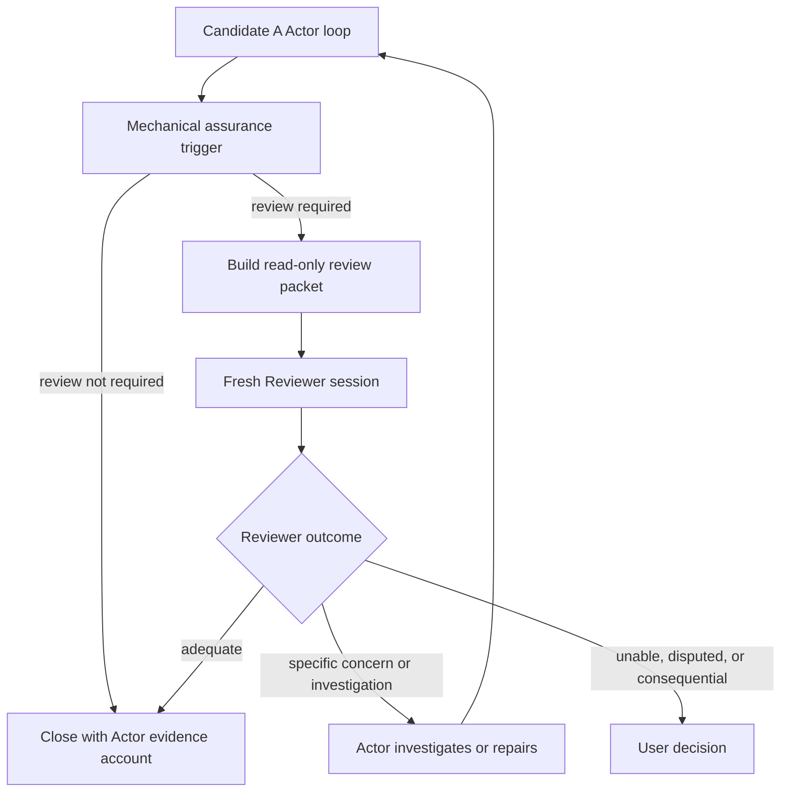
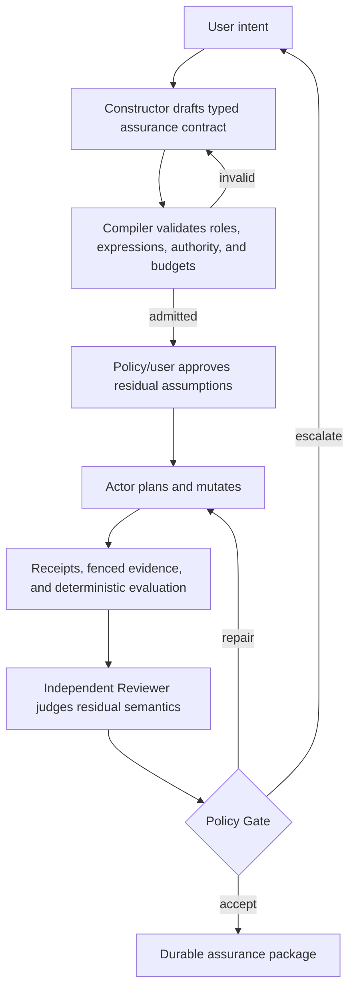

# Coordinating Intelligence Candidate Architectures

**Status:** Architecture comparison; working baseline recommendation only

**Comparison date:** 2026-08-17

**Inputs:**

- evidence ledger at commit `855f98d5`;
- claims and responsibility map at commit `13ade0fc`;
- mechanism dispositions at commit `bc2d36f0`.

## 1. Purpose

This document defines three complete coordinating-intelligence architecture
candidates. Each candidate describes the full loop from user intent through
action, observation, correction, completion, and interruption handling. Every
mechanism must justify its presence by the responsibility it owns and the
evidence that makes that responsibility necessary.

The candidates are:

1. **Minimal Empirical Actor Loop**: one grounded Actor reasons and iterates
   inside a small deterministic shell.
2. **Adaptive Independent Review Loop**: the same Actor loop, with a fresh
   read-only Reviewer invoked only when policy or observed uncertainty warrants
   its cost.
3. **Contract-Compiled Assurance Workflow**: a Constructor, typed contract,
   compiler, deterministic evaluator, Reviewer, and durable policy gate for
   contexts requiring a predeclared assurance case.

This is not an implementation plan. It does not authorize product changes,
deployment, model contact, or a new qualification campaign.

## 2. Shared Evidence Constraints

All three candidates inherit these facts from the evidence:

1. The original user request must remain an exact source of truth.
2. Models may interpret the request but may not silently replace it.
3. Grasshopper component identity and metadata come from the live host.
4. Model-facing calls use the canonical gateway and strict schemas.
5. Covered terminal mutations return solve-readiness receipts.
6. Behavioral observations after mutation are receipt-fenced.
7. Tool errors, partial commits, lifecycle gaps, and unsupported observations
   remain visible.
8. A clean canvas is not sufficient evidence of semantic correctness.
9. A model completion claim is attributed judgment, not runtime fact.
10. Correction is bounded by time, calls, progress, and mutation policy.
11. Knowledge is advisory and cannot override live host evidence.
12. User escalation is selective and reserved for real ambiguity, consequence,
    or unresolved judgment.

These constraints form the common substrate. The candidates differ in how they
construct and judge meaning above it.

## 3. Comparison Criteria

| Criterion | Question |
|---|---|
| Open-intent freedom | Can the system handle a request whose semantic structure was not predefined? |
| Runtime grounding | Are decisions tied to authoritative, current host evidence? |
| Semantic error detection | What can catch a mechanically clean but conceptually wrong result? |
| Correction | Who interprets failure and how may another attempt occur? |
| Completion authority | Who decides that the user intent has been adequately satisfied? |
| Latency and token cost | How many model roles, contexts, and observations are normally required? |
| Recovery | What survives interruption without replaying ambiguous mutation? |
| Object-catalog risk | How much predefined semantic vocabulary must grow with new user intents? |
| Current evidence maturity | Which parts have actually run successfully under comparable conditions? |
| Product complexity | How many durable owners, schemas, transitions, and policies are required? |

## 4. Candidate A: Minimal Empirical Actor Loop

### 4.1 Objective

Make one capable local Actor responsible for interpreting, building,
investigating, correcting, and explaining the result. Keep deterministic code
focused on truthful interaction with the world rather than pre-encoding the
meaning of every possible request.

This is the closest candidate to the simple loop:

**Disposition basis:** `MD-01` through `MD-05`, narrowed mechanisms `MD-06`
through `MD-09`, adoption-blocked Prime `MD-10`, and experimental Actor/adapter
mechanisms `MD-11` and `MD-12`. Interpretive basis: `CI-02`, `CI-04` through
`CI-11`, and `CI-16` through `CI-18`.



### 4.2 Participants and mechanisms

| Participant or mechanism | Responsibility | Why included |
|---|---|---|
| User | Supply intent and decide genuine preferences or consequential ambiguity | The system cannot infer normative choices reliably. |
| Qwen3.8 Actor | Interpret, discover, plan, mutate, inspect, investigate, repair, and make attributed semantic judgments | Open-grid and helix evidence demonstrates bounded capability across these functions. |
| Prime or equivalent Actor host | Preserve reasoning state, IPython work, and canonical tool access | Prime enabled sustained empirical loops and same-session correction, subject to its adoption prerequisites. |
| Rook gateway | Enforce exact capability calls and retain structured results/failures | Prevents malformed arguments, hidden bypass, and protocol ambiguity. |
| Native discovery and metadata | Expose installed components, duplicate identities, ports, and provenance | Prevents guessing and knowledge-store identity errors. |
| Mutation receipts and fenced snapshots | Establish that observed outputs follow the relevant mutation and solve | Prevents reasoning from stale computation. |
| Working intent brief | Maintain an open-text list of interpreted obligations, assumptions, and unresolved questions | Gives the Actor something stable to revisit without requiring a fixed semantic ontology. |
| Bounded Worker, optional | Handle a clearly scoped code or transformation leaf | Reuses the mature Worker boundary without forcing all work through it. |
| Ephemeral investigation, optional | Execute model-authored, read-only analysis over retained evidence | Lets intelligence formulate a new test without adding a permanent product predicate. |
| Minimal supervisor | Enforce lifecycle, latest-receipt freshness, budgets, progress, and truthful closure | Bounds wandering and prevents self-report from overriding missing custody. |
| Advisory knowledge, optional | Supply provenance-bearing priors when requested | May reduce rediscovery but remains outside runtime authority. |

### 4.3 Full loop

#### Stage A0: Admit the session

The supervisor retains:

- exact user intent and revisions;
- target document identity;
- effective model/runtime identity;
- allowed Rook profile;
- mutation, call, elapsed-time, and context budgets; and
- interruption ownership.

It verifies canonical runtime custody before mutation. This stage exists because
stale deployment, wrong import paths, and target mismatch have invalidated past
experiments.

#### Stage A1: Build a working intent brief

The Actor restates the request as open-text obligations, assumptions, and
questions. For example:

```text
obligation: provide independently adjustable start, spacing, and count
obligation: produce points along the X axis
obligation: keep Y and Z fixed at zero
assumption: default values may be selected unless the user supplied them
```

The shell validates only custody and shape, not semantic meaning. The brief is
not a Phase A contract and contains no closed predicate catalog. If the Actor
detects a material ambiguity, it asks the user before mutation.

Brief revisions are append-only. The Actor may add or refine an obligation, but
deletion or material reinterpretation retains the earlier text and a reason.
The original user intent remains visible throughout.

This stage challenges the bare loop slightly: without a retained interpretation,
the Actor can silently substitute `EndX` for `Step` and later forget the original
relationship.

#### Stage A2: Orient to the live document

The Actor obtains current document status and a snapshot appropriate to the
task. It determines whether it is creating, extending, or repairing. It may
inspect viewport evidence when available and useful.

No mutation occurs from an assumed empty or assumed current canvas.

#### Stage A3: Discover capabilities

The Actor searches the live component catalog and reads authoritative metadata
before relying on ambiguous names or unknown ports. It may consult advisory
knowledge, but live metadata wins every conflict.

Discovery is demand-driven. The Actor does not receive the full tool or
component catalog by default.

#### Stage A4: Form an implementation hypothesis

The Actor chooses topology, components, values, and an execution sequence. The
hypothesis may remain in its reasoning/session trace rather than requiring a
universal semantic graph.

If a leaf is sufficiently bounded, the Actor may delegate it to the Worker with
an exact contract. Otherwise the Actor remains responsible for the topology.

#### Stage A5: Mutate through canonical routes

The Actor calls admitted mutation capabilities. Rook validates arguments,
identities, route policy, temporary IDs, and partial/complete outcomes. Every
covered terminal mutation produces an authentic receipt.

A partially committed result remains visible. The Actor cannot treat an
exception as proof that nothing changed.

#### Stage A6: Wait and observe

The loop waits on the latest eligible receipt and obtains a fenced snapshot.
The Actor inspects:

- components and wiring;
- diagnostics;
- output counts and data previews;
- relevant point or geometry evidence;
- status and errors; and
- viewport evidence when it can answer a question not available structurally.

Observation is selective. Repeated snapshots without a changed hypothesis or
new evidence request count against progress.

#### Stage A7: Compare evidence with the working brief

Before evaluating the brief, the Actor rereads the exact original request and
performs an explicit coverage check for requirements omitted or materially
changed in its own interpretation. The original request, initial brief, and
revised brief are all visible. This remains self-audit; the shell can prove the
texts were presented but cannot prove that the Actor noticed every omission.

The Actor accounts for each obligation as:

```text
satisfied with cited evidence
contradicted by cited evidence
still unresolved and why
requires user judgment and why
```

This is intelligent judgment. The shell verifies that cited artifacts and
component/output identities exist, but it does not pretend to understand every
claim.

#### Stage A8: Investigate an unresolved claim

When existing observations are insufficient, the Actor chooses among:

- another read-only Rook query;
- a temporary value perturbation followed by receipt-fenced observation and
  exact restoration;
- a bounded read-only analysis over retained JSON evidence;
- a viewport capture;
- authoritative component metadata; or
- a user clarification.

A model-authored analysis is retained with its code, inputs, output, and errors.
It does not become a permanent Rook predicate merely because it was useful once.
It may not mutate the host except through admitted Rook routes.

Deterministic execution proves that the retained analysis ran over the retained
inputs. It does not prove that the Actor chose a relevant formula or interpreted
the output correctly. Those remain attributed judgment and may trigger review
or user escalation.

#### Stage A9: Repair

If evidence contradicts the brief and the failure is repairable, the Actor
updates its hypothesis and mutates again. Every correction creates new receipt
and evidence custody.

The supervisor stops or escalates on:

- elapsed or call budget;
- repeated identical failure;
- no new evidence or hypothesis across a bounded number of cycles;
- restoration failure;
- lifecycle loss;
- target/runtime drift; or
- a mutation whose state cannot be established safely.

The correction count is policy, not a semantic truth. It should be informed by
observed progress and cost rather than frozen universally at one or three.

#### Stage A10: Close truthfully

Completion requires two distinct closures.

**Mechanical closure:**

- the latest terminal mutation has a ready receipt;
- the final observation is fenced to that receipt;
- no later evidence-invalidating mutation exists;
- lifecycle and source trace close;
- retained diagnostics are disclosed; and
- budgets and process state are recorded.

**Semantic closure:**

- every working obligation is accounted for;
- evidence citations are retained;
- judgments are labeled as judgments;
- unresolved material claims are disclosed; and
- the Actor states why it considers the result adequate.

The supervisor can verify the mechanical closure and completeness of the
account. It cannot mechanically certify the truth of arbitrary open-text
semantic judgments.

### 4.4 Recovery

Candidate A needs a minimal durable record, not necessarily the full workflow
router:

```text
exact intent and working brief
target and runtime identity
last completed stage
last terminal mutation and receipt
last fenced evidence set
source/session trace references
whether mutation replay is forbidden
```

After interruption, read-only orientation may be repeated. An ambiguous
mutation is never replayed automatically. The Actor either resumes from proven
state or asks for escalation.

### 4.5 What Candidate A deliberately excludes

- mandatory Constructor Agent;
- Phase A semantic compiler;
- prepackaged acceptance JSON per task;
- permanent independent Reviewer;
- closed Reviewer defect taxonomy;
- universal semantic graph;
- knowledge in the authoritative path; and
- a seven-stage workflow router.

### 4.6 Direct challenge to Candidate A

Candidate A accepts that an intelligent Actor may occasionally judge a
semantically wrong result adequate. Receipts and clean diagnostics cannot
prevent that. The working brief can reduce forgotten requirements but is itself
model-authored. A model can construct a plausible explanation around its own
mistake.

Choosing Candidate A therefore means accepting attributed, fallible semantic
judgment as a normal product property. The compensation is empirical freedom,
lower latency, and no requirement to pre-encode the domain of design meaning.

The strongest missing evidence is whether Qwen3.8 can catch a plausible
semantic substitution through its own final review when no deterministic
acceptance artifact tells it what failed.

## 5. Candidate B: Adaptive Independent Review Loop

### 5.1 Objective

Preserve Candidate A as the ordinary path, but add a fresh read-only model
perspective when consequence, uncertainty, novelty, or observed Actor behavior
justifies the latency.

**Disposition basis:** Candidate A plus experimental Reviewer `MD-16` and
minimal recovery from `MD-17`. Interpretive basis: `CI-09`, `CI-13`, and
`CI-16`.



### 5.2 Additional participants and mechanisms

| Mechanism | Responsibility | Why included |
|---|---|---|
| Assurance trigger | Decide whether independent review is worth its cost | Avoids paying Reviewer latency on every ordinary task. |
| Fresh Reviewer session | Challenge requirement coverage, assumptions, weakening, and unresolved risks | The Actor may be blind to errors created by its own reasoning path. |
| Review packet | Present exact intent, working brief, final evidence, Actor account, and relevant trace without Actor conversational momentum | Gives the Reviewer an independent context while preserving evidence custody. |
| Review response admission | Validate response shape, citations, lifecycle, and disposition | Prevents malformed or uncited critique from becoming authority. |
| Escalation policy | Route disagreements, inability, or high-consequence uncertainty | Reviewer judgment is not final truth. |

### 5.3 Full loop

#### Stage B0-B10: Execute Candidate A

The Actor completes every Candidate A stage through mechanical and semantic
closure. Candidate B does not replace grounded iteration with a plan/review
ceremony before work begins.

#### Stage B11: Evaluate the assurance trigger

Review may be required by explicit product policy or observed run state. Useful
triggers include:

- the user requests independent review;
- the Actor marks a material claim uncertain;
- required meaning could not be tied to authoritative runtime evidence;
- the task crosses a configured consequence boundary;
- correction or no-progress thresholds were approached;
- novel geometry or unsupported observations materially affect completion;
- the final explanation materially differs from the original working brief; or
- the Actor reports success after partial commits or substantial reconstruction.

The trigger vocabulary describes workflow risk, not every domain defect. It
must not become a catalog of possible design mistakes.

#### Stage B12: Build the review packet

The deterministic shell assembles:

- exact user intent and revisions;
- the Actor's working brief and assumptions;
- final receipt and fenced evidence;
- relevant earlier contradictory evidence;
- the Actor's obligation-by-obligation completion account;
- diagnostics and restoration results;
- runtime/model identities; and
- the specific reason review was triggered.

The Actor does not rewrite this packet for the Reviewer.

#### Stage B13: Run a fresh read-only Reviewer

The Reviewer receives no mutation profile. It may reason, inspect retained
evidence, request an admitted read-only investigation, or state that it cannot
resolve the question.

Its output contains:

```text
overall judgment: adequate | concerns | unable_to_establish
findings: open-text statements with evidence citations
assumptions or missing evidence
recommended investigation, if any
residual risk
```

The categories are deliberately small. Findings are not forced into an
exhaustive semantic taxonomy.

#### Stage B14: Admit and route the review

The shell verifies response structure, citation existence, and lifecycle. It
does not mechanically endorse the finding's semantic truth.

- `adequate` permits closure but remains attributed Reviewer judgment.
- `concerns` returns evidence to the Actor for investigation or repair.
- `unable_to_establish` routes to the user or closes with explicit uncertainty,
  depending on policy and consequence.
- Actor/Reviewer disagreement is preserved rather than silently resolved by
  role priority.

#### Stage B15: Correct or escalate

The Actor may perform a bounded evidence-driven correction using the same
receipt and observation loop. A materially changed result may receive one fresh
review under policy; the architecture does not recursively create Critics of
Critics.

The user decides when disagreement is normative, high consequence, or cannot be
resolved through additional evidence.

### 5.4 Recovery

Candidate B retains Candidate A state plus:

- review-trigger reason;
- immutable review packet hash;
- Reviewer model/session identity;
- Reviewer response and citations; and
- whether a post-review mutation invalidated the review.

A review never survives a materially changed final state without explicit
revalidation.

### 5.5 What Candidate B deliberately excludes

- mandatory review of every task;
- Reviewer mutation rights;
- Reviewer override of host facts;
- a closed exhaustive defect ontology;
- automatic majority voting;
- repeated debate loops; and
- the Phase A compiler as a prerequisite.

### 5.6 Direct challenge to Candidate B

Phase B did not qualify Qwen3.8 as residual semantic authority. It missed
authority misrouting and mishandled hidden unresolved risk. A Reviewer may share
the Actor's model-family blind spots while adding latency and false concerns.

Candidate B is justified only if selective review catches important errors that
Candidate A's self-review misses at an acceptable cost. Independence of session
is useful, but it is not independence of training data or reasoning tendencies.

## 6. Candidate C: Contract-Compiled Assurance Workflow

### 6.1 Objective

Construct an explicit assurance case before or alongside implementation, admit
its deterministic portion through a typed compiler, evaluate supported claims
against receipt-fenced runtime evidence, and route residual semantics through
independent judgment and user policy.

This candidate is designed for repeatability, audit, and higher-consequence
work rather than minimum latency.

**Disposition basis:** narrowed PlanGraph `MD-06`, experimental semantic
lowering `MD-13`, Phase A compiler `MD-14`, Constructor `MD-15`, Reviewer
`MD-16`, and durable workflow state `MD-17`. The integrated router package
remains suspended as `MD-18`. Interpretive basis: `CI-11` through `CI-18`.



### 6.2 Participants and mechanisms

| Participant or mechanism | Responsibility | Why included |
|---|---|---|
| Constructor model | Translate intent into roles, claims, deterministic expressions, assumptions, and residuals | A predeclared assurance case cannot be hand-authored for every product request. |
| Phase A compiler | Reject malformed references, types, authority, quantification, tolerance, and budget use | Mechanical coherence must not depend on Reviewer interpretation. |
| Semantic manifest | Hold the typed accepted contract and admitted operation vocabulary | Enables repeatable deterministic evaluation and explicit unsupported results. |
| Actor model | Design and implement the Grasshopper result | Contract construction does not determine topology. |
| PlanGraph/Worker, optional | Lower exact execution regions and bounded leaves | Reuses deterministic execution and mature Worker contracts where beneficial. |
| Receipt-fenced evidence collector | Correlate runtime facts with the implementation under evaluation | Prevents stale or unrelated evidence from satisfying the contract. |
| Deterministic evaluator | Execute admitted expressions and classify pass/fail/unproven | Supplies repeatable evidence for mechanically expressible claims. |
| Independent Reviewer | Judge disclosed residuals, omissions, assumptions, and material weakening | The compiler cannot establish intent adequacy. |
| Policy Gate | Combine mechanical outcomes, attributed judgment, consequence, and user policy | Prevents either compiler or Reviewer from becoming total authority. |
| Durable workflow store | Preserve phase ownership, artifacts, mutation state, and crash recovery | The longer multi-role workflow cannot rely on one conversational session. |
| User | Approve materially unresolved assumptions and high-consequence acceptance | Some design meaning is normative rather than observable. |

### 6.3 Full loop

#### Stage C0: Select the assurance route

Product policy chooses Candidate C because the task belongs to a prequalified
assurance domain, the user requests it, or consequences require a predeclared
case. Candidate C is not entered merely because Candidate A encountered an
unknown word.

The durable workflow store records exact intent, route reason, target, model
identities, budgets, and exclusive phase owner.

#### Stage C1: Clarify intent and policy

The Constructor identifies requirements, assumptions, user decisions, and
available evidence types. Material ambiguity returns to the user. Knowledge may
provide advisory domain priors with provenance.

#### Stage C2: Construct the assurance contract

The Constructor produces:

- symbolic roles and value types;
- requirement and claim identifiers;
- deterministic expressions where the admitted language can express them;
- evidence requests and precision;
- authority mode for each claim;
- residual qualitative claims;
- assumptions and unresolved risks; and
- evaluation budgets.

The Constructor cannot extend the language or mark an unsupported relation
deterministic.

#### Stage C3: Compile and admit

The Phase A compiler validates the artifact against identical manifest bytes.
Invalid artifacts receive exact diagnostics. A bounded Constructor continuation
may correct mechanics, but repeated schema repair stops rather than consuming
the entire workflow.

Compilation proves contract coherence only. It does not prove that the contract
faithfully covers the user's intent.

#### Stage C4: Review the contract before mutation

A fresh Reviewer examines requirement coverage, assumption honesty, material
weakening, authority allocation, and residual risk. The user approves any
material unresolved requirement required by policy.

This stage is included because a coherent but inadequate contract can make a
wrong implementation pass perfectly.

#### Stage C5: Plan and implement

The Actor receives the admitted contract but retains topology freedom. It uses
authoritative discovery and metadata, optional semantic lowering, optional
bounded Workers, and canonical Rook mutation routes.

The contract describes required outcomes and evidence, not the exact graph,
unless topology itself is an explicit user requirement.

#### Stage C6: Collect fenced evidence

Every terminal mutation is receipt-correlated. The evidence collector obtains
only admitted structural, diagnostic, point, geometry, value, viewport, and
perturbation observations within declared budgets.

Unsupported evidence yields `unproven`; it does not trigger automatic language
or Rook expansion.

#### Stage C7: Evaluate deterministic claims

The evaluator executes compiled expressions over retained evidence. Each claim
is classified independently as pass, fail, or unproven with exact inputs and
diagnostics.

Generated one-off investigations may supplement evidence, but they do not
silently become compiled contract operations.

#### Stage C8: Review residual semantics

The independent Reviewer receives the original intent, admitted contract,
mechanical results, residual claims, Actor account, and evidence. It identifies
omission, weakening, assumptions, and unresolved risk using attributed
judgment.

Reviewer findings cannot override deterministic facts and do not automatically
mutate the implementation.

#### Stage C9: Apply Policy Gate

The gate routes:

- deterministic failure to bounded repair when eligible;
- unproven claims to investigation, Reviewer judgment, or user escalation;
- Reviewer concerns to Actor investigation or user decision;
- complete accepted evidence to closure; and
- infrastructure or custody failure to incomplete without semantic verdict.

The gate has a small workflow disposition vocabulary. It does not encode every
possible semantic defect.

#### Stage C10: Correct with contract continuity

The Actor repairs within a bounded cycle. A new terminal receipt invalidates old
runtime evidence. A changed requirement invalidates the contract and returns to
construction rather than being smuggled into implementation.

#### Stage C11: Close the assurance package

The durable result contains:

- exact user intent and decisions;
- admitted contract and compiler identity;
- Actor/Worker identities and traces;
- terminal receipts and fenced evidence;
- deterministic evaluations;
- Reviewer judgments and citations;
- Policy Gate decisions;
- unresolved risks;
- final target/runtime custody; and
- lifecycle closure.

### 6.4 Recovery

Every stage writes append-only state before transferring ownership. Read-only
stages may restart from immutable inputs. Mutation stages never replay an
ambiguous call automatically. A resumed evaluator must revalidate evidence and
contract hashes before use.

### 6.5 What Candidate C deliberately excludes

- automatic operation-vocabulary expansion;
- runtime generation of authoritative compiler rules;
- Reviewer authority over deterministic facts;
- hidden user-assumption defaults;
- synchronous Grasshopper solving;
- replay of ambiguous mutation; and
- use as the default path before its handoffs are qualified.

### 6.6 Direct challenge to Candidate C

Candidate C has the highest risk of turning design meaning into an expanding
object catalog. Constructor roles, value types, expression operations, evidence
projections, residual categories, and policy transitions can all grow.

Its integrated chain is also the least qualified candidate. Phase A established
compiler coherence, not intent adequacy or runtime evaluation. Phase B did not
qualify the Reviewer. The first Constructor handoff failed. The full router is
currently suspended.

Candidate C is defensible only where the cost of an explicit assurance case is
worthwhile and the domain vocabulary can be prequalified without pretending to
cover open-ended design.

## 7. Mechanism Inclusion Matrix

| Mechanism | Candidate A | Candidate B | Candidate C |
|---|---|---|---|
| Exact intent custody | Required | Required | Required |
| Qwen3.8 Actor | Required | Required | Required or replaceable by qualified Actor |
| Prime/equivalent persistent host | Conditional on adoption repair | Conditional on adoption repair | Conditional per model role |
| Canonical gateway and strict admission | Required | Required | Required |
| Native discovery and metadata | Required when Grasshopper components are involved | Same as A | Same as A |
| Mutation receipts and fenced observation | Required | Required | Required |
| Open-text working intent brief | Required | Required | Replaced by typed contract plus residuals |
| Bounded Worker | Optional leaf | Optional leaf | Optional leaf |
| PlanGraph execution representation | Optional | Optional | Expected when deterministic lowering adds value |
| Ephemeral model-authored investigation | Optional and important | Optional and important | Supplemental, non-authoritative to compiler vocabulary |
| Common deterministic evaluator | Optional generic checks | Optional generic checks | Required for compiled claims |
| Same-session repair | Bounded | Bounded | Bounded under Policy Gate |
| Fresh independent Reviewer | Excluded by default | Conditional | Required by assurance policy |
| Phase A compiler | Excluded | Excluded | Required |
| Acceptance Constructor | Excluded | Excluded | Required |
| Knowledge retrieval | Optional advisory | Optional advisory | Optional advisory during construction/review |
| Durable workflow state | Minimal recovery record | Minimal plus review state | Full append-only phase ownership |
| User escalation | Ambiguity/consequence | Ambiguity, disagreement, consequence | Contract decisions, residuals, consequence |

## 8. Comparative Evaluation

| Criterion | Candidate A | Candidate B | Candidate C |
|---|---|---|---|
| Open-intent freedom | Highest | High | Lowest outside prequalified contract vocabulary |
| Runtime grounding | High | High | High |
| Independent semantic challenge | None by default | Conditional fresh Reviewer | Required Reviewer plus Policy Gate |
| Mechanical semantic repeatability | Only supported generic checks or generated witnesses | Same as A | Highest within admitted expression language |
| Typical latency | Lowest | Medium and trigger-dependent | Highest |
| Product complexity | Lowest | Medium | Highest |
| Object-catalog expansion risk | Low | Low to medium | High |
| Recovery complexity | Low to medium | Medium | High |
| Current integrated evidence | Strongest: grid and helix approximate this loop | Partial: Reviewer value mixed | Weakest: handoffs not integrated or qualified |
| Principal failure risk | Actor misses its own semantic error | Reviewer misses or invents concerns while adding cost | Coherent contract incompletely represents intent |
| Best fit | Ordinary interactive design and empirical exploration | Higher-risk or visibly uncertain ordinary work | Prequalified, auditable, consequential workflows |

## 9. Direct Challenge To The Simple Baseline

The simple loop is not challenged by the fact that Qwen makes mistakes. Every
candidate contains fallible intelligence. It is challenged by whether the Actor
can notice its own plausible semantic substitutions.

The evidence contains three warnings:

1. Qwen3.6 produced a clean Range/EndX graph and declared it complete despite an
   explicit Step requirement.
2. Qwen3.6 hard-coded five points and declared completion while Start, Step, and
   Count controlled nothing.
3. Nemotron stopped without Construct Point and still claimed success.

Qwen3.8 is materially stronger in the observed tasks, but the grid and helix
passes were confirmed by operator-owned behavioral probes. They do not prove
that Qwen would have detected every semantic defect itself.

Therefore the honest Candidate A baseline is not:

```text
Qwen says done -> done
```

It is:

```text
Qwen maintains explicit interpreted obligations
-> acts against authoritative runtime state
-> cites fresh evidence for every obligation
-> formulates new investigations when needed
-> discloses unresolved meaning
-> deterministic shell verifies custody and bounded progress
```

If we remove the working brief, evidence account, freshness shell, and budgets,
we are not simplifying the architecture. We are discarding lessons established
by repeated failures.

Conversely, no evidence currently requires a mandatory Constructor, compiled
semantic contract, or Reviewer for every ordinary request.

## 10. Working Baseline Recommendation

### 10.1 Default

Adopt **Candidate A, the Minimal Empirical Actor Loop**, as the new architecture
baseline for ordinary interactive Grasshopper work.

`Baseline` here means the smallest reference hypothesis against which additional
mechanisms must demonstrate value. It does not mean production-ready. The exact
working-brief, self-audit, ephemeral-investigation, progress, and recovery loop
has not yet been qualified as one integrated system.

This recommendation is based on:

- the successful Qwen3.8 open-grid and helix behavior;
- the maturity of Rook discovery, admission, receipts, and fenced observation;
- the bounded Worker option for narrow leaves;
- the ability of an intelligent Actor to formulate runtime investigations; and
- the absence of evidence that a universal acceptance language or mandatory
  Reviewer is required for ordinary work.

### 10.2 Escalation profile

Treat **Candidate B** as a conditional assurance profile, not the default. Its
value must be demonstrated specifically on failures Candidate A does not catch.
The current Reviewer evidence does not justify unconditional invocation.

### 10.3 Specialized research track

Keep **Candidate C** as a specialized high-assurance research candidate. Its
compiler, Constructor, Reviewer, and durable state mechanisms should remain
independently testable. The suspended full router should not become the default
architecture unless it outperforms the smaller candidates on a measured
high-assurance need.

## 11. Decision-Producing Evidence, Not An Infinite Prompt Campaign

A later qualification of Candidate A should test the architecture question, not
model trivia:

> Can a grounded Qwen3.8 Actor use its own working brief, fresh runtime evidence,
> and self-authored investigations to detect and correct a plausible semantic
> mistake without a prewritten acceptance contract?

One structurally novel task with a deliberately observable opportunity for
self-correction is more informative than many paraphrases of point rows or
grids. The independent operator may inspect the final state afterward to score
the experiment, but must not feed a hidden acceptance answer into the Actor.

Candidate B earns promotion only if its conditional Reviewer catches a material
miss from Candidate A without unacceptable false concerns or latency. Candidate
C earns promotion only if a real high-assurance use case requires repeatable
compiled claims and its adjacent handoffs pass.

## 12. Explicit Nonauthorization

This comparison does not authorize:

- implementation of any candidate;
- modification of Prime or Rook;
- deployment or model contact;
- a new acceptance vocabulary;
- a new prompt corpus;
- a Reviewer campaign;
- a Candidate A qualification; or
- retirement or deletion of existing code.

The next step is user review of the candidates, their trade-offs, and the
working baseline recommendation before any design is converted into a
production specification.
