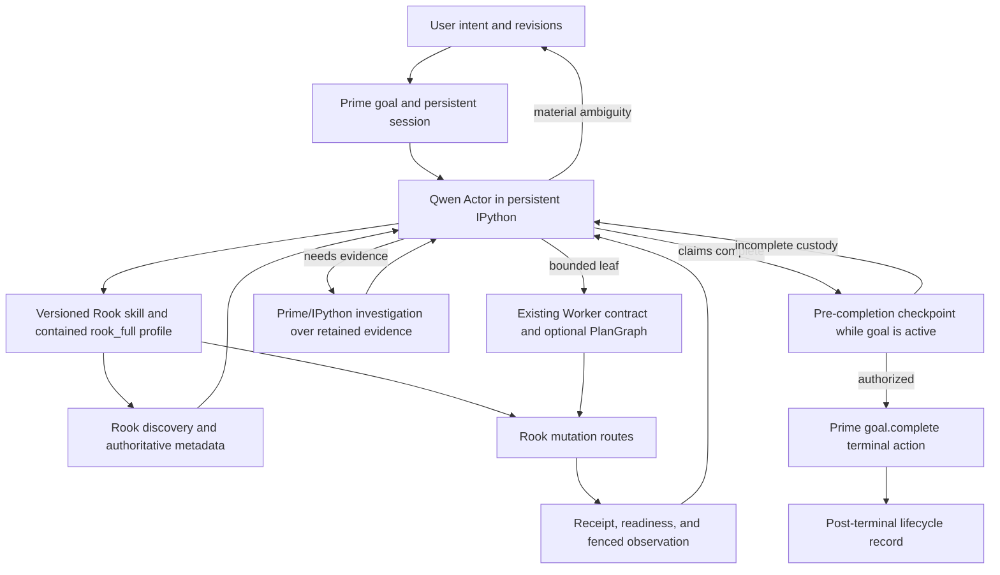
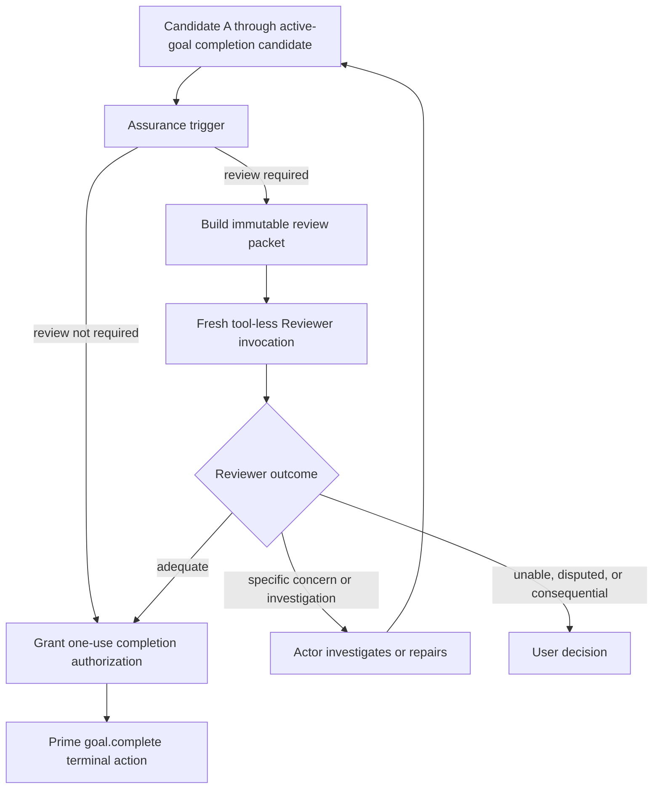
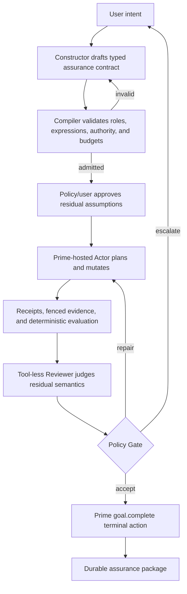

# Coordinating Intelligence Candidate Architectures

**Status:** Architecture comparison; Candidate A continuity-corrected working
baseline recommendation only

**Comparison date:** 2026-08-17

**Inputs:**

- evidence ledger at commit `855f98d5`;
- claims and responsibility map at commit `13ade0fc`;
- mechanism dispositions at commit `bc2d36f0`.
- Prime continuity inspection at working checkout `c98941a2`.

## 1. Purpose

This document defines three complete coordinating-intelligence architecture
candidates. Each candidate describes the full loop from user intent through
action, observation, correction, completion, and interruption handling. Every
mechanism must justify its presence by the responsibility it owns and the
evidence that makes that responsibility necessary.

The candidates are:

1. **Prime-Native Empirical Actor Loop**: one grounded Actor reasons and
   iterates inside the evidenced Prime/Rook runtime lineage.
2. **Adaptive Independent Review Loop**: the same Actor loop, with a fresh
   tool-less Reviewer invoked only when policy or observed uncertainty warrants
   its cost.
3. **Contract-Compiled Assurance Workflow**: a Constructor, typed contract,
   compiler, deterministic evaluator, Reviewer, and durable policy gate for
   contexts requiring a predeclared assurance case.

This is not an implementation plan. It does not authorize product changes,
deployment, model contact, or a new qualification campaign.

## 2. Shared Evidence Constraints

All three candidates inherit these facts from the evidence:

1. The original user request must remain an exact source of truth.
2. Models may interpret the request but may not silently replace it.
3. Grasshopper component identity and metadata come from the live host.
4. Model-facing calls use the canonical gateway and strict schemas.
5. Covered terminal mutations return solve-readiness receipts.
6. Behavioral observations after mutation are receipt-fenced.
7. Tool errors, partial commits, lifecycle gaps, and unsupported observations
   remain visible.
8. A clean canvas is not sufficient evidence of semantic correctness.
9. A model completion claim is attributed judgment, not runtime fact.
10. Correction is bounded by time, calls, progress, and mutation policy.
11. Knowledge is advisory and cannot override live host evidence.
12. User escalation is selective and reserved for real ambiguity, consequence,
    or unresolved judgment.

These constraints form the common substrate. The candidates differ in how they
construct and judge meaning above it.

### 2.1 Continuity rule

Architecture comparison starts from the real integrated system that produced
the evidence. A later design may narrow, repair, or replace a mechanism, but it
may not silently convert a concrete owner into an interchangeable box.

For every retained mechanism, a candidate must state:

1. its current owner and implementation;
2. the evidence established through that implementation;
3. whether the candidate uses, repairs, narrows, or supersedes it;
4. the exact handoff when the mechanism is conditional; and
5. any unqualified behavior that remains an adoption gap;
6. the ordering of reversible work relative to terminal state transitions; and
7. identity and budget custody when one goal, session, artifact, or receipt
   supersedes another.

`Optional` means that an explicit route decides whether to use a preserved
mechanism. It does not mean that prior work disappears. `Equivalent` is not an
acceptable substitute for an evidenced runtime unless equivalence is itself
qualified.

Operational model evidence belongs to the full observed configuration:

```text
model and reasoning settings
+ Prime version and session behavior
+ skill and adapter bytes
+ admitted Rook profile
+ Rook runtime and target
+ evidence and closure rules
```

No single element receives sole credit for a result produced by that system.

## 3. Comparison Criteria

| Criterion | Question |
|---|---|
| Open-intent freedom | Can the system handle a request whose semantic structure was not predefined? |
| Runtime grounding | Are decisions tied to authoritative, current host evidence? |
| Semantic error detection | What can catch a mechanically clean but conceptually wrong result? |
| Correction | Who interprets failure and how may another attempt occur? |
| Completion authority | Who decides that the user intent has been adequately satisfied? |
| Latency and token cost | How many model roles, contexts, and observations are normally required? |
| Recovery | What survives interruption without replaying ambiguous mutation? |
| Object-catalog risk | How much predefined semantic vocabulary must grow with new user intents? |
| Current evidence maturity | Which parts have actually run successfully under comparable conditions? |
| Product complexity | How many durable owners, schemas, transitions, and policies are required? |

## 4. Candidate A: Prime-Native Empirical Actor Loop

### 4.1 Objective and continuity position

Use the actual Prime/Rook stack that produced the strongest local-model results
as the baseline for ordinary interactive Grasshopper work. Repair its known
adoption gaps without inventing a second agent loop, a second goal manager, or a
parallel source of runtime truth.

The semantic strategy remains empirical: Qwen interprets open intent, acts in
the live world, observes consequences, and revises its hypothesis. The runtime
strategy is concrete rather than generic:

```text
user intent
-> Prime goal and persistent Actor session
-> Qwen reasoning and persistent IPython investigation
-> versioned Rook skill and contained rook_full adapter
-> canonical Rook gateway
-> live discovery, mutation, receipts, and fenced evidence
-> evidence returns to the same Prime goal/session
-> Qwen investigates, repairs, or escalates
-> outer mechanical closure admits or refuses completion
```

**Disposition basis:** established `MD-01` through `MD-05`; narrowed but
preserved `MD-06` through `MD-09`; repair-before-adoption Prime `MD-10`;
experimental Qwen and adapter mechanisms `MD-11` and `MD-12`; and the
interruption evidence motivating `MD-17`. Interpretive basis: `CI-01` through
`CI-11` and `CI-15` through `CI-18`.

Candidate A is not a proposal to start over around Qwen. It is a proposal to
finish integrating the system already exercised across the Prime/Rook rows.



### 4.2 Proven runtime lineage and treatment

| Existing mechanism | Current owner and evidence | Candidate A treatment |
|---|---|---|
| Goal persistence and continuation | Current Prime `/goal` retains the objective across turns, accounts for usage, issues continuation context, and asks for a requirement audit before `goal.complete()`; the retained Grasshopper rows did not qualify this complete goal-owned loop | Use directly and qualify in integration. Do not create a parallel goal or continuation engine. |
| Actor conversation and tool loop | Prime agent loop processes model responses, tool calls, steering, follow-ups, continuations, and terminal events | Use directly, with bounded stop hooks and outer lifecycle verification. |
| Persistent investigation | Prime IPython preserves variables, imports, and loaded data across calls and supports best-effort restoration | Use as the Actor's working laboratory. Do not mislabel it ephemeral or inherently read-only. |
| Model-facing instructions | Frozen skills materially affected successful Prime/Qwen behavior | Make the exact skill identity part of the effective runtime profile. |
| Model-facing capability projection | `rook_full.search/read/call` contained catalog access; payload-first V5 removed envelope confusion while retaining protocol evidence | Promote the reviewed payload-first contract to a durable owner before production adoption. |
| Structured failures | Reviewed Prime structured-error behavior plus Rook trace handling preserved authentic failure evidence and later receipts | Preserve the exact cross-repository contract and exception behavior. |
| Gateway and admission | Rook canonical gateway, strict argument admission, and script-authoring routing are merged and tested | Required for every model-facing host call. |
| Discovery and identity | Native ranking, ambiguity preservation, direct GUID metadata, and provenance passed live qualification | Required whenever component identity or ports matter. Knowledge cannot replace it. |
| Mutation and solve truth | Rook receipts, readiness registry, source trace, and fenced reads passed model-free and model-involved tests | Rook remains the sole owner of mutation and solve truth. |
| Behavioral acceptance core | Rook's current common evaluator caught false completion and enabled bounded repair within its admitted vocabulary | Preserve as an available assurance mechanism. Do not claim it covers arbitrary intent or require a bespoke contract for every task. |
| Bounded Worker | Existing Worker contracts repeatedly accepted or declined bounded evidence-conditioned work | Preserve as a real delegation route with its existing contract, not as a generic model call. |
| PlanGraph and compositional lowering | Existing modules and live slices represented exact execution dependencies and one Worker/deterministic composition | Preserve for admitted exact regions. Do not require it to represent all semantic intent. |
| Advisory knowledge | Existing system is present but has no measured positive effect on the later Prime/Qwen rows | Keep outside authority; invoke only through an explicit, measurable advisory route. |
| Empirical qualification | Frozen configurations, evidence manifests, and independent observations exposed model and infrastructure failures | Continue for configuration changes and architecture claims; do not turn it into exhaustive prompt enumeration. |

### 4.3 Ownership boundaries

#### Prime owns

- the persistent Actor session;
- the active user-provided goal and retained supersession history;
- the ordinary model/tool/continuation loop;
- the persistent IPython working environment;
- the model's reasoning and same-session correction history;
- native session evidence; and
- the model-authored terminal completion action through `goal.complete()` after
  integration authorization.

Prime does not own Rhino or Grasshopper truth, mutation success, component
identity, final receipt selection, or semantic infallibility.

#### Rook owns

- the admitted capability surface and strict arguments;
- target and document identity at host contact;
- component discovery, identity, metadata, and ambiguity;
- mutation execution and partial-commit truth;
- solve receipts, epochs, readiness, and fenced reads;
- structural, diagnostic, point, and currently supported behavioral evidence;
- script-authoring capability routing; and
- exact protocol results and failures at the MCP boundary.

Rook does not own open-ended intent interpretation or a universal vocabulary of
design meaning.

#### The Rook skill and `rook_full` adapter own

- the small model-facing interface presented inside Prime;
- payload-first Python ergonomics without losing the authentic MCP envelope;
- source-event retention for success, refusal, partial commit, and failure;
- exclusion of raw Prime MCP dynamic methods from the model-facing adapter
  object; and
- guidance about schema reading and canonical capability use.

They do not own copied schemas, hidden retries, result reinterpretation,
runtime truth, or containment of arbitrary network/process activity initiated
through the broader IPython environment.

#### The thin integration owner owns

- starting the exact Prime goal/session from the product entry point;
- effective model, reasoning, Prime, skill, adapter, Rook, and target custody;
- the admitted Rook profile;
- call, mutation, elapsed-time, and no-progress policy;
- final lifecycle, source-trace, and latest-receipt closure; and
- interruption disposition across the Prime/Rook boundary.

This is an integration responsibility, not authorization for a second planner,
another conversational state machine, or a duplicate workflow router. Its
production location remains an explicit design decision.

#### Qwen owns attributed judgment

Qwen interprets intent, chooses topology, selects investigations, evaluates
evidence, decides repairs, and explains unresolved claims. Its conclusions
remain attributed and fallible. The user owns normative preferences and
consequential ambiguity.

### 4.4 Full Prime-native loop

#### Stage A0: Admit the effective runtime

The integration owner verifies the complete operational configuration:

- Prime commit and effective provider/model configuration;
- exact model manifest and reasoning setting;
- exact skill and adapter bytes;
- admitted Rook profile;
- deployed Rook runtime identity;
- Rhino process, port, and document identity; and
- session budgets and interruption ownership.

This is not experiment-only ceremony. Stale Python, stale managed binaries,
wrong target identity, adapter drift, and model-setting changes all altered or
invalidated prior results. Product checks may be automated and quieter, but the
ownership does not disappear.

#### Stage A1: Start or supersede the Prime goal

The exact user request is retained as source evidence and becomes the Prime goal
objective when it fits Prime's existing objective limit. Entering a replacement
`/goal` does not revise the active goal in place: Prime creates a new `goalId`
and resets per-goal token, time, and continuation accounting. Earlier objective
and session history remain retained, but the integration owner records the new
goal as superseding the earlier identity and applies cumulative task budgets
across the chain.

Candidate A does not silently truncate or summarize an oversized request.
Admission must either obtain a bounded user-approved objective or add a
separately reviewed exact-reference mechanism. It does not create a competing
objective database before Prime receives the task.

Within the session, Qwen maintains an open-text obligation account containing:

- interpreted requirements;
- assumptions;
- unresolved questions;
- evidence still needed; and
- material changes in interpretation.

This account augments the Prime goal; it does not supersede it. The original
objective remains the source Qwen must reread before completion. The account is
not a Phase A contract, acceptance JSON, or closed predicate language.

#### Stage A2: Orient to the live document

Through the contained Rook profile, Qwen establishes document status and the
current Grasshopper state. It determines whether it is creating, extending, or
repairing. It does not assume an empty or unchanged canvas.

Structural snapshots and supported point evidence are current capabilities.
Viewport capture may be used when actually available. Broader fenced geometry
projection remains an open capability and is not assumed by this candidate.

#### Stage A3: Discover capabilities and schemas

Qwen uses `rook_full.search`, `rook_full.read`, and `rook_full.call`. It searches
the live component catalog and obtains authoritative metadata before wiring
unknown components or resolving ambiguous names. The full MCP or component
catalog is not exposed by default.

The payload-first adapter returns capability data to Python while retaining the
original structured envelope in evidence. Authentic failures remain failures;
partial commits and zero-dispatch refusals remain distinguishable.

Prime currently opens a fresh MCP session for each capability call. Candidate A
accepts that behavior for correctness and accounts for its latency until a
separate measured optimization proves another lifecycle safe.

#### Stage A4: Form an implementation hypothesis

Qwen chooses topology, components, values, and an action sequence in its Prime
session. The hypothesis may remain in reasoning and IPython state. Candidate A
does not require a universal semantic graph merely to permit action.

When Qwen can express an exact execution region in the admitted semantic-design
graph schema, it may submit that region to the existing deterministic compiler.
The compiler, not Qwen, validates and lowers an admitted region into execution
PlanGraph state. Compiler refusal returns diagnostics to the still-active Prime
goal and creates no runnable PlanGraph state. Once admitted, the existing
PlanGraph runner owns step state, ordering, dispatch, and receipt collection;
its outputs and failures return to the parent Prime session as evidence.

If no admitted region can be expressed, Qwen retains direct whole-definition
responsibility. It does not author PlanGraph runtime state by hand.

#### Stage A5: Delegate a bounded leaf when justified

Worker delegation is eligible only when the leaf has:

- an exact bounded objective;
- admitted inputs and expected output/interface;
- retained evidence and allowed actions;
- deterministic disposition rules; and
- an explicit return path into the parent Prime session.

The exact handoff is:

```text
Qwen or the semantic compiler identifies one bounded leaf
-> deterministic Worker request validation freezes contract and evidence
-> existing Worker harness returns a candidate action or decline
-> existing Worker disposition and acceptance-source logic admits or refuses it
-> only an admitted action reaches the Rook mutation dispatcher
-> mutation result and receipt return through PlanGraph when present
   and always return to the parent Prime goal
```

The Worker does not mutate directly, become an independent planner, or accept
its own output. A decline or refused candidate returns evidence to Qwen while
the goal remains active. If the bounded-contract conditions or deterministic
admission owner are absent, Qwen does not delegate.

#### Stage A6: Mutate through canonical Rook routes

Qwen mutates only the Rhino/Grasshopper target through the admitted Rook
profile. Rook validates arguments, identities, route policy, temporary IDs,
and partial/complete outcomes. Every covered terminal mutation produces an
authentic receipt.

A raised exception does not imply that nothing changed. Structured failure
evidence and any committed receipt remain visible to Prime and the closure
owner.

Prime IPython itself is a broad local Python and `%%bash` environment. Candidate
A therefore distinguishes **target mutation containment**, which Rook can
enforce, from **process and filesystem containment**, which remains a Prime
product-adoption decision. It does not claim that current IPython is read-only.

#### Stage A7: Wait and observe current computation

After a covered mutation, the latest eligible terminal receipt is waited through
Rook's readiness owner. Qwen then obtains a receipt-fenced snapshot or another
receipt-fenced supported observation. A genuinely read-only task may use an
ordinary document-identified observation only when the admitted source trace
contains no target mutation. It may inspect:

- components, parameters, wiring, and groups;
- errors and warnings;
- output counts and bounded previews;
- supported point evidence;
- status and error surfaces; and
- available viewport evidence.

No older receipt is silently reused after a later evidence-invalidating
mutation. A decorative route that does not require a solve must be classified
truthfully rather than invalidating or blessing computation by accident.

#### Stage A8: Compare evidence with the Prime goal

Qwen rereads the exact active goal and its obligation account. For each material
requirement it records one of:

```text
satisfied with cited host evidence
contradicted with cited host evidence
unresolved and requiring another investigation
blocked by unavailable evidence or capability
requires user judgment
```

This is a model-authored evidence account, not automatic semantic truth. The
integration owner can validate cited artifact identity and freshness but cannot
prove arbitrary design meaning from the prose alone.

The thin integration owner applies product policy and retained task context to
select the exact existing reviewed behavioral artifact. It records the
artifact identity and hash, freezes those exact bytes before evaluation, seals
the caller-owned authoring trace, selects the latest eligible terminal receipt,
runs the existing receipt-fenced probe, and invokes the deterministic evaluator.
The closed result returns to the still-active Prime goal:

```text
pass      -> supports pre-completion closure for the covered claims
fail      -> supplies exact criterion evidence for Qwen repair
unproven  -> returns to Qwen investigation, optional review, or user escalation
incomplete -> forbids semantic repair until custody is restored
```

Qwen may propose an investigation, but it does not select or modify an artifact
after seeing the result and then accept its own contract. The evaluator does
not receive credit for unsupported semantics, and its absence does not force
creation of a new task-specific acceptance artifact.

#### Stage A9: Investigate in the same Prime session

If a claim remains unresolved, Qwen uses its persistent IPython workspace to
formulate and run a new empirical test. Available actions include:

- another Rook query or authoritative metadata read;
- a temporary control perturbation, receipt wait, observation, and exact
  restoration;
- analysis of retained JSON evidence in Python;
- a supported viewport capture;
- an existing deterministic evaluator operation; or
- a user clarification.

The code, inputs, outputs, and errors remain in the Prime session evidence.
Executing an analysis deterministically proves that the code ran over those
inputs. Relevance, formula choice, and interpretation remain Qwen's attributed
judgment.

An investigation is not promoted into a permanent Rook predicate merely
because it helped once. Repeated cross-task pressure may justify a separately
reviewed generic evidence operation.

#### Stage A10: Repair through Prime continuation

When evidence contradicts the hypothesis and progress remains plausible, Qwen
repairs in the same Prime goal/session. Prime's existing tool loop and goal
continuation carry the work; Candidate A does not insert a second outer model
conversation for ordinary repair.

Every target correction creates new Rook custody. The integration owner stops
or escalates on:

- elapsed, call, context, or mutation budget;
- repeated equivalent failure;
- no new evidence or changed hypothesis across bounded cycles;
- restoration failure;
- target or runtime drift;
- lifecycle loss; or
- a mutation whose resulting state cannot be established safely.

Correction count is operational policy informed by progress and cost, not a
universal semantic constant.

#### Stage A11: Pass the pre-completion checkpoint while the goal is active

Prime `goal.complete()` is terminal, not a reversible completion request. Before
calling it, Qwen submits a structured completion candidate to an
integration-owned pre-completion checkpoint. The checkpoint is a new, bounded
integration operation that must be implemented and qualified; it does not alter
Prime goal state.

The candidate identifies:

- the active `goalId` and any superseded goal chain;
- the current obligation account and evidence citations;
- the latest relevant terminal receipt and fenced observation, when mutation
  occurred;
- any deterministic evaluation result selected by policy; and
- Qwen's requested disposition: complete, blocked, or user judgment required.

While the Prime goal remains active, the integration owner verifies every
pre-terminal condition it can establish:

- the source trace prefix is authentic and gap-free;
- if target mutation occurred, the latest relevant terminal mutation has an
  eligible ready receipt and the final observation is fenced to it;
- if no target mutation occurred, the trace establishes that read-only path and
  the final observation retains current document identity;
- no later evidence-invalidating mutation exists;
- partial commits and retained diagnostics are disclosed;
- process and cumulative task-budget state are admissible;
- any selected behavioral evaluator completed with authentic custody; and
- the model-authored evidence account addresses every retained obligation.

Semantic closure remains explicitly attributed:

- deterministic facts are reported as facts only within their admitted scope;
- Qwen judgments are labeled as judgments;
- unresolved material claims are not converted into success; and
- genuine preference or consequential ambiguity returns to the user.

Checkpoint refusal returns exact evidence or custody diagnostics through
Prime's existing continuation path. The same goal remains active for
investigation, repair, or escalation. Candidate B inserts any conditional
Reviewer before this checkpoint grants completion authorization.

Authorization is host-owned state, not a bearer token exposed to the model. It
is one-use and bound to the active `goalId`, supersession chain, target document,
source-trace epoch and prefix, latest receipt, cited evidence hashes, and
cumulative task-budget state.

Granting authorization moves the integration record into
`completion_pending`, while the Prime goal itself remains active. Across the
admitted Prime-host and Rook capability surface, the only model-controlled
operation permitted from that state is `goal.complete()`. Any intervening
mutation, tool or host action, goal supersession, steering event, relevant
evidence change, or cumulative-budget change invalidates authorization before
dispatch and returns the record to active work. A new checkpoint is then
required.

#### Stage A12: Complete the Prime goal terminally

After pre-completion authorization, Qwen calls Prime `goal.complete()`. The
production integration must implement one host-owned terminalization
transaction before `_completeGoalFromHost()` changes goal state. Current Prime
does not implement this transaction.

The transaction must atomically:

1. verify the one-use authorization and all bound identities and epochs;
2. consume the authorization in a replay-proof transition;
3. close the admitted model-controlled Prime-host operation surface for that
   goal;
4. revoke or close the goal-scoped Rook capability before another target call
   can dispatch; and
5. set the Prime goal inactive and terminal.

An unauthorized or stale call refuses before state transition and leaves the
goal active. A duplicate completion refuses. Once completion succeeds, a later
statement in the same IPython cell may still execute as Python, but any
`rook_full` call or other admitted product-host operation for that completed
goal must refuse before target dispatch. Therefore this is a terminal execution
fence over the admitted product capability surface, not a claim that current
Prime stops Python bytecode, filesystem access, subprocesses, or arbitrary
network access. Broader IPython containment remains a separate Prime decision.
There is no same-goal repair path after the successful terminalization.

The integration owner then records the terminal Prime lifecycle and native
session closure. If the required `agent_end` or final session evidence is
missing, the product result is `incomplete`; it does not pretend that the goal
remained active. Recovery requires current-state orientation and an explicitly
linked superseding goal rather than automatic replay.

Post-terminal work is limited to durable recording and presentation of the
already authorized outcome. It cannot add a Reviewer, reinterpret evidence, or
route concerns back into the completed goal.

Terminalization recovery is phase-specific:

- before authorization, the goal remains active and no completion state exists;
- after authorization but before completion, recovery invalidates the pending
  authorization and leaves the goal active for a fresh checkpoint;
- after terminal state but before `agent_end`, the goal remains complete, its
  Rook capability remains revoked, and the product outcome is `incomplete`
  until current state is oriented through an explicitly linked superseding
  goal; and
- no crash case automatically replays completion or a possibly committed
  mutation.

### 4.5 Recovery without a parallel orchestrator

Recovery begins with existing owners:

1. Prime retains the goal, conversation, native session, and best-effort
   IPython snapshot.
2. Rook retains host state and receipt truth for its bounded lifetime.
3. The thin integration record correlates the two systems across interruption.

The cross-boundary record contains only what neither system can establish alone:

```text
Prime session, active-goal identity, and superseded-goal chain
per-goal accounting plus cumulative task-budget accounting
effective model, skill, adapter, and Rook profile identity
target document identity
last known terminal mutation and receipt
last admitted fenced evidence
source-trace and lifecycle closure state
whether a possibly committed mutation forbids automatic replay
```

After interruption, Qwen may repeat read-only orientation. Best-effort IPython
restoration is not treated as proof that all Python objects or external handles
survived. An ambiguous mutation is never replayed automatically. Recovery
resumes from current host evidence or escalates.

### 4.6 Adoption repairs and unresolved integration decisions

Candidate A depends on closing these real gaps rather than creating substitute
mechanisms:

1. **Prime lineage:** choose and maintain the reviewed structured-error behavior
   against an identified Prime base or upstream equivalent.
2. **Payload-first adapter:** assign the V5 contract a durable product owner and
   test it against success, structured failure, malformed envelopes, and mutable
   payloads.
3. **Tool containment:** mechanically expose only the admitted `rook_full`
   profile from Prime's MCP integration despite its dynamic escape surfaces,
   and separately decide how unrestricted IPython network/process access is
   governed.
4. **Terminalization protocol:** implement and qualify the integration-owned
   pre-completion operation, host-owned `completion_pending` state, one-use
   authorization, Prime host-operation fence, and goal-scoped Rook capability
   revocation before `_completeGoalFromHost()` changes state. Causal tests must
   cover wrong goal, document, trace epoch, receipt, evidence, and budget;
   intervening mutation, tool action, steering, supersession, and evidence
   change; unauthorized, stale, and duplicate completion; same-cell mutation
   after completion; and crashes before authorization, between authorization
   and completion, and after terminal state but before `agent_end`. Qualify the
   authorized terminal action, native-session closure, and incomplete
   post-terminal recovery behavior without claiming broader IPython sandboxing.
5. **Product entry:** decide whether the current managed Rook Chat starts and
   presents the Prime goal/session or Prime remains a separately surfaced
   runtime. Current Chat, public MCP, and internal-agent bridge paths are not
   assumed equivalent, and Prime continues through the canonical MCP gateway.
6. **Cross-boundary state and supersession:** place the thin integration record
   without duplicating Prime conversation or Rook runtime state; link every
   replacement `goalId` and enforce cumulative task budgets across per-goal
   accounting resets.
7. **IPython authority:** explicitly accept or constrain filesystem, process,
   and shell access; do not confuse Rook target containment with OS sandboxing.
8. **Performance:** measure the fresh-MCP-session-per-call cost and the context
   growth of long Prime sessions before optimizing either.
9. **Worker/PlanGraph handoff:** connect the existing compiler, PlanGraph,
   Worker request, disposition, mutation, and receipt-return chain to Prime in a
   product-visible way before claiming end-user integration.
10. **Behavioral-evaluator handoff:** assign artifact selection, trace sealing,
    probe execution, classification, and active-goal feedback to the integration
    owner without allowing the Actor to approve its own artifact.
11. **Knowledge:** measure one targeted advisory intervention before assigning
    it runtime value.

### 4.7 What Candidate A deliberately excludes

- replacement of Prime with an unspecified equivalent host;
- a second planner or continuation loop around Prime;
- a parallel objective store that competes with Prime `/goal`;
- mandatory Constructor Agent;
- mandatory Phase A semantic compiler;
- prepackaged acceptance JSON for every task;
- permanent independent Reviewer;
- closed Reviewer defect taxonomy;
- universal semantic graph;
- knowledge in the authoritative host path; and
- automatic replay of ambiguous mutations.

It does not exclude the existing Worker, PlanGraph, common evaluator, or
advisory knowledge system. It preserves them behind explicit, evidence-bounded
routes.

### 4.8 Direct challenge to Candidate A

Candidate A still permits Qwen to judge a semantically wrong result adequate.
Receipts, clean diagnostics, Prime goal persistence, and an evidence account do
not make the Actor infallible. The Qwen3.6 Range/EndX and hard-coded-point runs
demonstrate this failure mode.

The strongest Qwen3.8 successes were produced by the Prime/Rook stack but were
ultimately scored by externally designed behavioral probes. They establish
grounded Actor capability and the usefulness of the runtime substrate. They do
not establish that Prime `/goal`, Qwen self-audit, and the thin closure owner
already form a qualified production acceptance boundary.

Choosing Candidate A therefore means testing a specific integration hypothesis:

> Can the existing Prime-native Actor loop, given exact goal persistence,
> authoritative Rook evidence, and freedom to author new runtime
> investigations, catch or honestly disclose a plausible semantic substitution
> without receiving a prewritten task answer?

That hypothesis should be qualified without removing the Worker, evaluator, or
other proven mechanisms from the product architecture. Candidate A is the
smallest continuity-preserving baseline, not a declaration that the rest of the
work was unnecessary.

## 5. Candidate B: Adaptive Independent Review Loop

### 5.1 Objective

Preserve Candidate A as the ordinary path, but add a fresh tool-less model
perspective over an immutable evidence packet when consequence, uncertainty,
novelty, or observed Actor behavior justifies the latency.

**Disposition basis:** Candidate A plus experimental Reviewer `MD-16` and
minimal recovery from `MD-17`. Interpretive basis: `CI-09`, `CI-13`, and
`CI-16`.



### 5.2 Additional participants and mechanisms

| Mechanism | Responsibility | Why included |
|---|---|---|
| Assurance trigger | Decide whether independent review is worth its cost | Avoids paying Reviewer latency on every ordinary task. |
| Fresh tool-less Reviewer invocation | Challenge requirement coverage, assumptions, weakening, and unresolved risks without inheriting Actor conversation or mutation authority | The Actor may be blind to errors created by its own reasoning path. |
| Review packet | Present exact intent, working brief, final evidence, Actor account, and relevant trace without Actor conversational momentum | Gives the Reviewer an independent context while preserving evidence custody. |
| Review response admission | Validate response shape, citations, lifecycle, and disposition | Prevents malformed or uncited critique from becoming authority. |
| Escalation policy | Route disagreements, inability, or high-consequence uncertainty | Reviewer judgment is not final truth. |

### 5.3 Full loop

#### Stage B0-B11: Execute Candidate A through the active-goal checkpoint

The Actor executes Candidate A through Stage A10, submits the Stage A11
completion candidate, and passes the mechanically checkable checkpoint
conditions. The Prime goal remains active and the checkpoint withholds its
one-use completion authorization until Candidate B routing finishes. Candidate
B does not replace grounded iteration with a plan/review ceremony before work
begins.

#### Stage B12: Evaluate the assurance trigger

Review may be required by explicit product policy or observed run state. Useful
triggers include:

- the user requests independent review;
- the Actor marks a material claim uncertain;
- required meaning could not be tied to authoritative runtime evidence;
- the task crosses a configured consequence boundary;
- correction or no-progress thresholds were approached;
- novel geometry or unsupported observations materially affect completion;
- the final explanation materially differs from the Prime-goal-anchored
  obligation account; or
- the Actor reports success after partial commits or substantial reconstruction.

The trigger vocabulary describes workflow risk, not every domain defect. It
must not become a catalog of possible design mistakes.

#### Stage B13: Build the review packet

The deterministic shell assembles:

- exact user intent and revisions;
- the Actor's obligation account and assumptions;
- final receipt and fenced evidence;
- relevant earlier contradictory evidence;
- the Actor's obligation-by-obligation completion account;
- diagnostics and restoration results;
- runtime/model identities; and
- the specific reason review was triggered.

The Actor does not rewrite this packet for the Reviewer.

#### Stage B14: Run a fresh tool-less Reviewer

The default Candidate B Reviewer uses a fresh, bounded direct-provider harness,
not a Prime session. The harness sends one immutable review packet and admits
one closed response. It exposes no Rook profile, IPython, filesystem, process,
shell, model-controlled network, or model-facing tool execution; the harness
performs only its frozen provider request. This is the containment shape used
by the Phase B qualification harness, but its production owner and the
Reviewer's semantic sensitivity remain unqualified.

The Reviewer may reason over retained evidence, request an additional
investigation in its response, or state that it cannot resolve the question. It
cannot execute that investigation itself. The integration owner may admit a
strictly read-only Rook query, append the result to a new immutable packet, and
start one new Reviewer invocation under policy. A Prime-based Reviewer is not
part of Candidate B unless its separate goal lifecycle, adapter profile,
IPython authority, and containment boundary are independently qualified.

Its output contains:

```text
overall judgment: adequate | concerns | unable_to_establish
findings: open-text statements with evidence citations
assumptions or missing evidence
recommended investigation, if any
residual risk
```

The categories are deliberately small. Findings are not forced into an
exhaustive semantic taxonomy.

#### Stage B15: Admit and route the review

The shell verifies response structure, citation existence, and lifecycle. It
does not mechanically endorse the finding's semantic truth.

- `adequate` permits the active-goal checkpoint to grant its one-use completion
  authorization but remains attributed Reviewer judgment.
- `concerns` returns evidence to the Actor for investigation or repair.
- `unable_to_establish` routes to the user or closes with explicit uncertainty,
  depending on policy and consequence.
- Actor/Reviewer disagreement is preserved rather than silently resolved by
  role priority.

#### Stage B16: Correct or escalate

The Actor may perform a bounded evidence-driven correction using the same
receipt and observation loop. A materially changed result may receive one fresh
review under policy; the architecture does not recursively create Critics of
Critics.

The user decides when disagreement is normative, high consequence, or cannot be
resolved through additional evidence.

Any Actor mutation invalidates the earlier completion candidate, checkpoint,
and review packet. The still-active Prime goal returns through Candidate A
Stages A7-A11 before another review can be considered.

#### Stage B17: Complete the Prime goal terminally

When review is not required or an admitted Reviewer outcome permits closure,
the checkpoint enters Candidate A's host-owned `completion_pending` state bound
to the active `goalId`, final receipt, trace prefix, and reviewed evidence. Qwen
then performs Candidate A Stage A12 through the same terminal execution fence
and calls `goal.complete()` as the final admitted product-host action. No review
or same-goal repair occurs afterward.

### 5.4 Recovery

Candidate B retains Candidate A state plus:

- review-trigger reason;
- immutable review packet hash;
- Reviewer model/invocation identity;
- Reviewer response and citations; and
- whether a post-review mutation invalidated the review.

A review never survives a materially changed final state without explicit
revalidation.

### 5.5 What Candidate B deliberately excludes

- mandatory review of every task;
- Reviewer mutation rights;
- Reviewer override of host facts;
- a closed exhaustive defect ontology;
- automatic majority voting;
- repeated debate loops; and
- the Phase A compiler as a prerequisite.

### 5.6 Direct challenge to Candidate B

Phase B did not qualify Qwen3.8 as residual semantic authority. It missed
authority misrouting and mishandled hidden unresolved risk. A Reviewer may share
the Actor's model-family blind spots while adding latency and false concerns.

Candidate B is justified only if selective review catches important errors that
Candidate A's self-review misses at an acceptable cost. Independence of session
is useful, but it is not independence of training data or reasoning tendencies.

## 6. Candidate C: Contract-Compiled Assurance Workflow

### 6.1 Objective

Construct an explicit assurance case before or alongside implementation, admit
its deterministic portion through a typed compiler, evaluate supported claims
against receipt-fenced runtime evidence, and route residual semantics through
independent judgment and user policy.

This candidate is designed for repeatability, audit, and higher-consequence
work rather than minimum latency.

**Disposition basis:** narrowed PlanGraph `MD-06`, experimental semantic
lowering `MD-13`, Phase A compiler `MD-14`, Constructor `MD-15`, Reviewer
`MD-16`, and durable workflow state `MD-17`. The integrated router package
remains suspended as `MD-18`. Interpretive basis: `CI-11` through `CI-18`.



### 6.2 Participants and mechanisms

| Participant or mechanism | Responsibility | Why included |
|---|---|---|
| Tool-less Constructor invocation | Translate intent into roles, claims, deterministic expressions, assumptions, and residuals | A predeclared assurance case cannot be hand-authored for every product request. |
| Phase A compiler | Reject malformed references, types, authority, quantification, tolerance, and budget use | Mechanical coherence must not depend on Reviewer interpretation. |
| Semantic manifest | Hold the typed accepted contract and admitted operation vocabulary | Enables repeatable deterministic evaluation and explicit unsupported results. |
| Prime-hosted Qwen Actor goal | Design and implement the Grasshopper result in the same grounded runtime as Candidate A | Contract construction does not determine topology. |
| PlanGraph/Worker, optional | Lower exact execution regions and bounded leaves | Reuses deterministic execution and mature Worker contracts where beneficial. |
| Receipt-fenced evidence collector | Correlate runtime facts with the implementation under evaluation | Prevents stale or unrelated evidence from satisfying the contract. |
| Deterministic evaluator | Execute admitted expressions and classify pass/fail/unproven | Supplies repeatable evidence for mechanically expressible claims. |
| Tool-less independent Reviewer invocation | Judge disclosed residuals, omissions, assumptions, and material weakening | The compiler cannot establish intent adequacy. |
| Policy Gate | Combine mechanical outcomes, attributed judgment, consequence, and user policy | Prevents either compiler or Reviewer from becoming total authority. |
| Durable workflow store | Preserve phase ownership, artifacts, mutation state, and crash recovery | The longer multi-role workflow cannot rely on one conversational session. |
| User | Approve materially unresolved assumptions and high-consequence acceptance | Some design meaning is normative rather than observable. |

### 6.3 Role runtime and containment

Candidate C does not use the word `model` as an unspecified runtime owner:

| Role | Default runtime | Authority |
|---|---|---|
| Constructor | Fresh bounded direct-provider invocation over immutable intent, manifest, and prior compiler diagnostics | No Rook profile, IPython, filesystem, process, shell, model-controlled network, or mutation tools. The harness performs only its frozen provider request, and the model emits only a candidate contract. |
| Actor | One active Prime goal/session with the versioned Rook skill and contained `rook_full` adapter | Same target-mutation authority and adoption conditions as Candidate A. |
| Reviewer | Fresh bounded direct-provider invocation over an immutable review packet | No tools. Investigation requests return to the workflow owner rather than executing inside the Reviewer. |
| Worker | Existing bounded Worker harness reached only through deterministic request and disposition owners | Candidate action or decline; no direct mutation or self-acceptance. |
| Semantic compiler | Production owner undecided and unimplemented; current evidence comes from the disposable Phase A compiler | A selected production owner must compile the frozen manifest without model discretion before Candidate C can be adopted. |
| Deterministic evaluator | Production owner undecided and unimplemented; current evidence comes from the reviewed common evaluator and qualification harnesses | A selected production owner must evaluate only admitted expressions over fenced evidence. |
| Policy Gate | Production owner undecided and unimplemented | A selected production owner must combine attributed mechanical, Reviewer, policy, and user dispositions without becoming a semantic oracle. |
| Durable workflow store | Production owner undecided and unimplemented | A selected production owner must preserve append-only phase, identity, artifact, mutation, and recovery custody. |

The direct Constructor/Reviewer harness shape has transport and custody evidence
from the Phase B work but is not a qualified production runtime. A future choice
to host either role in Prime requires a separate role goal/session, exact
adapter profile, lifecycle, and IPython containment qualification. It cannot be
substituted by wording alone.

### 6.4 Full loop

#### Stage C0: Select the assurance route

Product policy chooses Candidate C because the task belongs to a prequalified
assurance domain, the user requests it, or consequences require a predeclared
case. Candidate C is not entered merely because Candidate A encountered an
unknown word.

The durable workflow store records exact intent, route reason, target, model
identities, budgets, and exclusive phase owner.

#### Stage C1: Clarify intent and policy

The tool-less Constructor identifies requirements, assumptions, user decisions,
and available evidence types from its immutable packet. Material ambiguity
returns to the user. Knowledge may provide advisory domain priors only when the
workflow owner includes their provenance in that packet.

#### Stage C2: Construct the assurance contract

The Constructor produces:

- symbolic roles and value types;
- requirement and claim identifiers;
- deterministic expressions where the admitted language can express them;
- evidence requests and precision;
- authority mode for each claim;
- residual qualitative claims;
- assumptions and unresolved risks; and
- evaluation budgets.

The Constructor cannot extend the language or mark an unsupported relation
deterministic.

#### Stage C3: Compile and admit

The Phase A compiler validates the artifact against identical manifest bytes.
Invalid artifacts receive exact diagnostics. A bounded fresh Constructor
invocation may receive the prior artifact and exact compiler diagnostic to
correct mechanics, but repeated schema repair stops rather than consuming the
entire workflow.

Compilation proves contract coherence only. It does not prove that the contract
faithfully covers the user's intent.

#### Stage C4: Review the contract before mutation

A fresh tool-less Reviewer invocation examines requirement coverage, assumption
honesty, material weakening, authority allocation, and residual risk from an
immutable packet. The user approves any material unresolved requirement
required by policy.

This stage is included because a coherent but inadequate contract can make a
wrong implementation pass perfectly.

#### Stage C5: Plan and implement

The workflow owner starts one Prime Actor goal with the exact intent, admitted
contract, residuals, and policy decisions. That goal remains active through
Stages C5-C10. The Actor retains topology freedom and uses authoritative
discovery and metadata, optional semantic lowering, optional bounded Workers,
and canonical Rook mutation routes.

The contract describes required outcomes and evidence, not the exact graph,
unless topology itself is an explicit user requirement.

#### Stage C6: Collect fenced evidence

Every terminal mutation is receipt-correlated. The evidence collector obtains
only admitted structural, diagnostic, point, geometry, value, viewport, and
perturbation observations within declared budgets.

Unsupported evidence yields `unproven`; it does not trigger automatic language
or Rook expansion.

#### Stage C7: Evaluate deterministic claims

The evaluator executes compiled expressions over retained evidence. Each claim
is classified independently as pass, fail, or unproven with exact inputs and
diagnostics.

Generated one-off investigations may supplement evidence, but they do not
silently become compiled contract operations.

#### Stage C8: Review residual semantics

The tool-less independent Reviewer receives the original intent, admitted
contract, mechanical results, residual claims, Actor account, and evidence in an
immutable packet. It identifies omission, weakening, assumptions, and
unresolved risk using attributed judgment. Any requested investigation returns
to the workflow owner and, if admitted, produces a new packet and invocation.

Reviewer findings cannot override deterministic facts and do not automatically
mutate the implementation.

#### Stage C9: Apply Policy Gate

The gate routes:

- deterministic failure to bounded repair when eligible;
- unproven claims to investigation, Reviewer judgment, or user escalation;
- Reviewer concerns to Actor investigation or user decision;
- complete accepted evidence to closure; and
- infrastructure or custody failure to incomplete without semantic verdict.

The gate has a small workflow disposition vocabulary. It does not encode every
possible semantic defect.

#### Stage C10: Correct with contract continuity

The Actor repairs within the still-active Prime goal. A new terminal receipt
invalidates old runtime evidence, pre-completion authorization, and review. A
changed requirement invalidates the contract and returns to construction rather
than being smuggled into implementation; the workflow store links any later
replacement Actor goal as a superseding identity.

#### Stage C11: Authorize terminal completion and close the assurance package

The Policy Gate may authorize completion only after the Candidate A
pre-completion checkpoint passes and all required review occurs while the Actor
goal remains active. Authorization is bound to the active `goalId`, admitted
contract, final receipt, trace prefix, evaluations, review packet, and user
decisions.

The Policy Gate enters Candidate A's host-owned `completion_pending` state.
Qwen then calls Prime `goal.complete()` through the same terminal execution
fence as the final admitted product-host action. The selected workflow-store
owner verifies the resulting terminal lifecycle. Missing terminal evidence
makes the result incomplete and cannot route back into the completed goal.

The durable result contains:

- exact user intent and decisions;
- admitted contract and compiler identity;
- Actor/Worker identities and traces;
- terminal receipts and fenced evidence;
- deterministic evaluations;
- Reviewer judgments and citations;
- Policy Gate decisions;
- unresolved risks;
- final target/runtime custody; and
- lifecycle closure.

### 6.5 Recovery

Every stage writes append-only state before transferring ownership. Read-only
stages may restart from immutable inputs. Mutation stages never replay an
ambiguous call automatically. A resumed evaluator must revalidate evidence and
contract hashes before use.

### 6.6 What Candidate C deliberately excludes

- automatic operation-vocabulary expansion;
- runtime generation of authoritative compiler rules;
- Reviewer authority over deterministic facts;
- hidden user-assumption defaults;
- synchronous Grasshopper solving;
- replay of ambiguous mutation; and
- use as the default path before its handoffs are qualified.

### 6.7 Direct challenge to Candidate C

Candidate C has the highest risk of turning design meaning into an expanding
object catalog. Constructor roles, value types, expression operations, evidence
projections, residual categories, and policy transitions can all grow.

Its integrated chain is also the least qualified candidate. Phase A established
compiler coherence, not intent adequacy or runtime evaluation. Phase B did not
qualify the Reviewer. The first Constructor handoff failed. The full router is
currently suspended.

Candidate C is defensible only where the cost of an explicit assurance case is
worthwhile and the domain vocabulary can be prequalified without pretending to
cover open-ended design.

## 7. Mechanism Inclusion Matrix

| Mechanism | Candidate A | Candidate B | Candidate C |
|---|---|---|---|
| Exact intent custody | Required | Required | Required |
| Qwen3.8 Actor | Required | Required | Required in the Prime Actor role or replaceable by separately qualified Actor |
| Prime goal and persistent session | Required after named adoption repairs | Same as A | Required for the Actor; Constructor/Reviewer use isolated tool-less invocations by default |
| Versioned Rook skill and contained `rook_full` adapter | Required | Required | Required for the Prime Actor; Constructor/Reviewer receive no Rook adapter |
| Goal supersession and cumulative task custody | Required | Same as A | Required for Actor-goal replacement and workflow transitions |
| Pre-completion checkpoint and terminal execution fence | Required but unimplemented | Same plus Reviewer-before-completion ordering | Required before Policy Gate acceptance becomes terminal |
| Canonical gateway and strict admission | Required | Required | Required |
| Native discovery and metadata | Required when Grasshopper components are involved | Same as A | Same as A |
| Mutation receipts and fenced observation | Required | Required | Required |
| Prime-goal-anchored obligation account | Required | Required | Typed contract plus residuals supplements the role goal |
| Bounded Worker | Preserved conditional leaf route | Same as A | Conditional leaf route |
| PlanGraph execution representation | Preserved for admitted exact regions | Same as A | Expected when deterministic lowering adds value |
| Persistent Prime/IPython investigation | Required capability, used as needed | Same as A | Supplemental and non-authoritative to compiler vocabulary |
| Common deterministic evaluator | Conditional on admitted evidence and operations | Same as A | Required for compiled claims |
| Same-session repair | Prime-native and bounded | Prime-native and bounded | Bounded under Policy Gate |
| Fresh independent Reviewer | Excluded by default | Conditional tool-less invocation | Required tool-less invocation by assurance policy |
| Phase A compiler | Excluded | Excluded | Required |
| Acceptance Constructor | Excluded | Excluded | Required |
| Knowledge retrieval | Optional advisory | Optional advisory | Optional advisory during construction/review |
| Durable state | Prime session plus thin cross-boundary custody | Same plus review packet state | Full append-only phase ownership |
| Product entry and lifecycle integration | Required unresolved integration decision | Same as A | Required for every role transition |
| User escalation | Ambiguity/consequence | Ambiguity, disagreement, consequence | Contract decisions, residuals, consequence |

## 8. Comparative Evaluation

| Criterion | Candidate A | Candidate B | Candidate C |
|---|---|---|---|
| Open-intent freedom | Highest | High | Lowest outside prequalified contract vocabulary |
| Runtime grounding | High | High | High |
| Independent semantic challenge | None by default | Conditional fresh Reviewer | Required Reviewer plus Policy Gate |
| Mechanical semantic repeatability | Only supported generic checks or generated witnesses | Same as A | Highest within admitted expression language |
| Typical latency | Lowest | Medium and trigger-dependent | Highest |
| Product complexity | Lowest new complexity, but requires Prime product integration | Medium | Highest |
| Object-catalog expansion risk | Low | Low to medium | High |
| Recovery complexity | Low to medium | Medium | High |
| Current integrated evidence | Strong Prime/Rook substrate evidence; exact goal/self-audit/closure integration unqualified | Partial: Reviewer value mixed | Weakest: handoffs not integrated or qualified |
| Principal failure risk | Actor misses its own semantic error | Reviewer misses or invents concerns while adding cost | Coherent contract incompletely represents intent |
| Best fit | Ordinary interactive design and empirical exploration | Higher-risk or visibly uncertain ordinary work | Prequalified, auditable, consequential workflows |

## 9. Direct Challenge To The Simple Baseline

The simple loop is not challenged by the fact that Qwen makes mistakes. Every
candidate contains fallible intelligence. It is challenged by whether the Actor
can notice its own plausible semantic substitutions.

The evidence contains three warnings:

1. Qwen3.6 produced a clean Range/EndX graph and declared it complete despite an
   explicit Step requirement.
2. Qwen3.6 hard-coded five points and declared completion while Start, Step, and
   Count controlled nothing.
3. Nemotron stopped without Construct Point and still claimed success.

Qwen3.8 is materially stronger in the observed tasks, but the grid and helix
passes were confirmed by operator-owned behavioral probes. They do not prove
that Qwen would have detected every semantic defect itself.

Therefore the honest Candidate A baseline is not:

```text
Qwen says done -> done
```

It is the existing Prime-native loop with explicit ownership:

```text
Prime retains the exact goal and continuation
-> Qwen maintains interpreted obligations in the same session
-> versioned skill and adapter constrain model-facing Rook access
-> Qwen acts against authoritative Rook runtime state
-> receipts and fenced observations return into Prime
-> Qwen cites evidence and formulates investigations in persistent IPython
-> existing Worker, PlanGraph, and evaluator routes remain available by policy
-> Qwen discloses unresolved meaning
-> thin integration owner verifies lifecycle, custody, and bounded progress
```

If we replace Prime's goal/session with a new working-brief engine, omit the
skill or adapter, or remove the Worker, evaluator, freshness boundary, and
budgets, we are not simplifying the architecture. We are discarding mechanisms
that materially shaped the observed results.

Conversely, no evidence currently requires a mandatory Constructor, compiled
semantic contract, or Reviewer for every ordinary request.

## 10. Working Baseline Recommendation

### 10.1 Default

Adopt **Candidate A, the Prime-Native Empirical Actor Loop**, as the working
architecture baseline for ordinary interactive Grasshopper work.

`Baseline` here means the smallest reference hypothesis against which additional
mechanisms must demonstrate value. It does not mean production-ready. The
underlying Prime/Rook interaction is real and repeatedly exercised. The exact
product entry, Prime-goal-anchored obligation account, self-audit, thin closure,
and recovery integration have not yet been qualified as one system.

This recommendation is based on:

- Prime's demonstrated persistent reasoning, IPython, gateway use, and
  same-session correction;
- the successful Qwen3.8 open-grid and helix behavior within that Prime/Rook
  configuration, while retaining the role of external behavioral probes;
- the maturity of Rook discovery, admission, receipts, and fenced observation;
- the separately established bounded Worker and compositional mechanisms;
- the material effect of exact skills, adapters, and error projection;
- the ability of an intelligent Actor to formulate runtime investigations; and
- the absence of evidence that a universal acceptance language or mandatory
  Reviewer is required for ordinary work.

### 10.2 Escalation profile

Treat **Candidate B** as a conditional assurance profile, not the default. Its
value must be demonstrated specifically on failures Candidate A does not catch.
The current Reviewer evidence does not justify unconditional invocation.

### 10.3 Specialized research track

Keep **Candidate C** as a specialized high-assurance research candidate. Its
compiler, Constructor, Reviewer, and durable state mechanisms should remain
independently testable. The suspended full router should not become the default
architecture unless it outperforms the smaller candidates on a measured
high-assurance need.

## 11. Decision-Producing Evidence, Not An Infinite Prompt Campaign

A later qualification of Candidate A should test the architecture question, not
model trivia:

> Can Qwen3.8, running in the repaired Prime-native goal/session with the exact
> Rook skill and adapter, use fresh Rook evidence and self-authored IPython
> investigations to detect and correct a plausible semantic mistake without a
> prewritten acceptance contract?

One structurally novel task with a deliberately observable opportunity for
self-correction is more informative than many paraphrases of point rows or
grids. The qualification must use the concrete Prime/Rook lineage rather than a
new surrogate harness. The independent operator may inspect the final state
afterward to score the experiment, but must not feed a hidden acceptance answer
into the Actor.

Candidate B earns promotion only if its conditional Reviewer catches a material
miss from Candidate A without unacceptable false concerns or latency. Candidate
C earns promotion only if a real high-assurance use case requires repeatable
compiled claims and its adjacent handoffs pass.

## 12. Explicit Nonauthorization

This comparison does not authorize:

- implementation of any candidate;
- modification of Prime or Rook;
- deployment or model contact;
- a new acceptance vocabulary;
- a new prompt corpus;
- a Reviewer campaign;
- a Candidate A qualification; or
- retirement or deletion of existing code.

The next step is user review of the candidates, their trade-offs, and the
working baseline recommendation before any design is converted into a
production specification.
