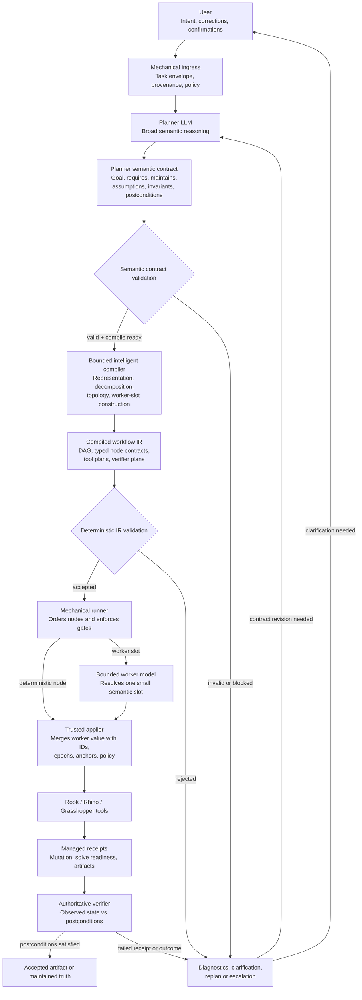

# Rook Semantic Contract, Compile, And Execution Theory

**Status:** Architecture theory and testable hypotheses

**Date:** 2026-07-11

## Grounding

This note explains the theory connecting Rook's user-facing Planner, bounded
intelligent compile phase, worker model seams, mechanical execution, and
authoritative verification.

Source revisions reviewed:

```text
Rook main: 253def90
OpenProse: dbdc810b8191c4059e8e3d26a30d86f63bf461e0
```

Primary companion documents:

- [Rook Planner Harness North-Star](2026-07-02-rook-planner-harness-north-star.md)
- [Rook OpenProse Compile Run Alignment Note](2026-07-08-rook-openprose-compile-run-alignment-note.md)
- [Rook Local/Internal Models North-Star](2026-06-19-rook-local-internal-models-north-star.md)
- [Rook North-Star Topology](2026-06-03-rook-north-star-topology.md)

Artifact and schema names in this note are candidates until their slice specs
freeze them. The authority model and compile/run cleavage are the durable claim.

## Core Theory

The system is based on one central idea:

> Intelligence should operate where meaning is ambiguous. Deterministic
> machinery should take over once meaning has been converted into an executable
> contract.

The Planner does not directly operate Grasshopper, and small workers do not
interpret the entire user request. Authority and freedom narrow as work moves
down the stack.

```text
User intent
-> Planner semantic judgment
-> bounded intelligent compilation
-> validated executable contracts
-> bounded worker decisions
-> mechanical tool execution
-> authoritative verification
```

This is closely aligned with OpenProse:

```text
semantic source
-> intelligent compile
-> deterministically validated IR
-> dumb reconciler/runtime
-> receipts
```

Rook adds stricter controls around geometry, document mutation, units,
coordinate frames, target identity, live solve readiness, and verifier floors.

## Architecture Diagram



## 1. What The Planner Receives

The Planner is the first intelligent semantic layer. A mechanical ingress layer
runs before it, but that layer only constructs a receipted context and forces
the required process. It does not decide meaning.

The Planner receives some bounded projection of:

- user brief;
- user corrections and confirmations;
- current Rhino and Grasshopper observations;
- project conventions;
- available Rook capabilities;
- applicable policies;
- prior receipts;
- known compiler patterns.

Its observation space is intentionally broad because it is the most capable
reasoning layer. The Planner may inspect the environment and reason about:

- what the user is trying to achieve;
- how current state differs from desired state;
- which requirements are explicit;
- which details can be reasonably assumed;
- which assumptions require confirmation;
- what outcomes should be verified;
- which capabilities are needed;
- whether the work should be decomposed;
- whether bounded worker judgment would be useful.

The Planner does not author GUIDs, short IDs, epochs, raw `gh_edit` batches, or
live mutation calls.

## 2. What The Planner Produces

The Planner produces a durable semantic contract. The current candidate schema
name is:

```text
rook.planner_graph_recipe:v1
```

Its conceptual grammar is:

```yaml
schema:
source_task:

goal:

requires:
  # Facts, observations and semantic dependencies.

maintains:
  # What must become or remain true.
  # Includes semantic postconditions.

assumptions:
  # Explicit Planner judgments and authorized defaults.

unresolved_intent:
  # Missing authority that cannot be safely assumed.

invariants:
  # Conditions that must hold on success and failure.

shape:
  self:
  delegates:
  prohibited:

required_capabilities:
worker_slots:
recipe_fingerprint:
```

This is not an implementation plan. It describes meaning.

For the radial box request, the semantic contract might say:

```text
Goal:
  Produce a Grasshopper definition representing a 10 x 10 box array.

Maintained truth:
  The result contains 100 boxes.
  Heights are lowest around the array center.
  Height does not decrease as radial distance increases.
  The definition reports no relevant Grasshopper errors.

Assumptions:
  Use World XY as the placement plane, if policy permits.
  Use a stated spacing and height range, if authorized.

Prohibited:
  Do not attribute assumptions to the user.
  Do not mutate unrelated canvas objects.
```

It does not say:

```text
Create component C1.
Connect C1.O0 to C2.I1.
Use epoch 37.
Submit this gh_edit payload.
```

## 3. How Authority Is Preserved

The recipe does not copy source facts and relabel them. It references authority
artifacts.

```text
User fact:
  authoritative for desired intent

Environment observation:
  authoritative for current observed state

Policy constraint:
  may block execution but cannot rewrite intent

Policy default:
  may fill an absent value when explicitly authorized

Planner assumption:
  explicit, typed when material, and policy- or user-authorized

Derived semantic fact:
  deterministically computed from authoritative facts

Compiler representation decision:
  chooses implementation without changing semantic outcomes
```

For example:

```text
User requests 10 x 10.
Existing canvas contains 8 x 8.
```

That is not a conflict:

```text
desired_state.grid = 10 x 10
observed_state.grid = 8 x 8
```

The difference is the work.

The semantic validator returns two separate results:

```text
valid:
  Is the recipe honest, coherent, and authority-correct?

compile_ready:
  Are required decisions, permissions, and confirmations available?
```

An honest contract can therefore be valid but not ready:

```text
valid = true
compile_ready = false
blocker = user confirmation required for material assumption
```

## 4. What The Intelligent Compiler Does

The compiler is not purely deterministic. This is the important OpenProse
correction.

The compiler is a fixed, constrained program that may invoke narrowly scoped
intelligent compile delegates. Those delegates can:

- resolve semantic relationships;
- choose a viable representation;
- select existing templates or patterns;
- construct execution topology;
- determine whether a worker slot is useful;
- compile semantic postconditions into verifier plans;
- produce exact tool IR.

The compiler is narrower than the Planner.

```text
Planner question:
  What design satisfies the user's intent?

Compiler question:
  How can the validated semantic contract be represented safely
  using the capabilities available in this environment?
```

For the radial field, the compiler might choose:

```text
Representation A:
  One C# generator component plus controls.

Representation B:
  Native Grasshopper components and connections.

Representation C:
  A reusable compiled Chirp or Rook component.
```

The semantic contract does not need to change when the representation changes.

Every material compiler decision must cite:

- semantic clause IDs;
- source facts;
- authorized assumptions;
- policy references;
- capability records.

The compiler emits bounded decision records, not raw chain-of-thought.

## 5. What The Compiler Produces

Compilation produces exact executable IR:

- compiled workflow fingerprint;
- node DAG;
- typed node inputs and outputs;
- worker contracts;
- trusted target-resolution rules;
- tool actions;
- mutation authority;
- acceptance criteria;
- verifier plans;
- failure and escalation paths.

This output is deterministically validated. The IR validator checks:

- schema correctness;
- provenance and authority;
- no undeclared semantic additions;
- topology integrity;
- tool availability;
- mutation authority;
- worker action schemas;
- verifier coverage;
- receipt requirements;
- no hidden target or answer leakage.

If validation fails, the IR does not execute and cannot be silently repaired by
the runtime.

## 6. Where Worker Models Enter

**Workers do not convert the complete Planner contract into a graph.**

The compiler decides where a bounded model judgment is useful and creates a
worker contract for that specific slot. A worker receives:

- one task;
- selected evidence;
- typed inputs;
- source-owned acceptance criteria;
- one or a few permitted actions;
- a strict structured output schema.

Examples of legitimate worker slots include:

- choosing one scalar value;
- drafting one script body;
- producing one formula fragment;
- classifying one observed condition;
- drafting repair parameters;
- summarizing one bounded evidence packet.

The worker does not receive broad canvas mutation authority.

For example:

```yaml
worker_contract:
  goal: Draft the generator body satisfying the compiled pin contract.

  inputs:
    grid_count_x: 10
    grid_count_y: 10
    semantic_relationship: radial_height_order

  allowed_action:
    action_id: draft_generator_body

  output:
    code: string
    mode: body
```

The compiler already chose the component shape, pins, trusted target, and
verifier. The worker fills one semantic slot inside that box.

A workflow may contain no workers at all. If the compiler can lower the
semantic contract entirely through trusted templates and deterministic
operations, it should do so.

## 7. From Worker Output To Tool Action

A worker's structured output is still only a proposal.

The trusted applier combines it with runtime-owned authority:

```text
worker-authored value or body
+ trusted target GUID
+ current epoch
+ validated pin contract
+ mutation policy
= dispatchable tool call
```

This is why a worker can safely author:

```json
{"value": 3.0}
```

without receiving the slider GUID. The worker supplies semantic content. The
harness supplies operational authority.

## 8. Execution And Verification

The runner executes accepted IR mechanically. It does not ask:

```text
Does this seem right?
What should happen next?
Did the canvas probably settle?
```

It follows the compiled graph and consumes receipts.

For Grasshopper mutation:

```text
mutation
-> pending managed readiness receipt
-> correlated solution completion
-> receipt-fenced output read
-> verifier comparison
```

Acceptance comes from observed state, not model confidence or worker
self-report. If the worker proposes the correct value but Grasshopper does not
produce the required output, the workflow fails verification.

## 9. Failure And Replanning

Failures remain attributable:

```text
semantic contract invalid
compile blocked by unresolved intent
unsupported capability
compiler ambiguity
IR validation failure
worker declined
worker publication malformed
tool mutation failed
readiness receipt failed
verifier rejected observed state
```

The Planner receives bounded diagnostics and receipts, not raw worker
transcripts. It can then:

- clarify with the user;
- revise an assumption;
- change representation;
- remove or add a worker slot;
- select another capability;
- recompile the remaining work.

Replanning happens at explicit frontiers. The runtime does not continuously
improvise.

## 10. Degrees Of Freedom Narrow Downward

The hierarchy is intentionally asymmetric:

```text
User:
  ultimate semantic intent authority
  no automatic execution authority

Planner:
  broad semantic reasoning
  no direct mutation authority

Compile delegates:
  narrower representation judgment
  exact output schemas

Worker:
  one bounded semantic decision

Applier:
  no semantic judgment
  trusted authority merge

Executor:
  no semantic judgment
  mechanical dispatch

Verifier:
  no design judgment
  observed postcondition check
```

A stronger model can improve Planner and compiler judgment without weakening
the deterministic runtime. A smaller model can remain useful because it
operates inside a narrow contract with strong evidence and a verifier floor.

## 11. The Main Hypotheses

The system is expected to work if the following claims hold:

1. A strong Planner can preserve user meaning in a semantic contract better
   than it can reliably author low-level tool payloads directly.
2. Intelligent representation choices are safer when made once during a
   bounded compile phase and frozen into validated IR.
3. Small models can perform useful work when their observation and action
   spaces are narrow and typed.
4. Correctness can be established by receipts and postconditions rather than
   model self-assessment.
5. New user requests usually become new contract instances and evaluation
   cases, not new core harness schemas.
6. Genuine new semantic capabilities require compiler patterns or lowerers,
   not ad hoc runtime improvisation.
7. The system can improve as models improve because intelligence remains at
   semantic authoring and compile boundaries rather than being hardcoded into
   runtime control flow.

## 12. What Exists Today

The evidence campaign has already demonstrated:

- Planner-authored worker requests;
- Planner-model strict structured authorship;
- a model-authored request driving a live worker repair;
- small-worker script repair;
- small-worker identity, non-identity, and affine scalar reasoning;
- `20/20` affine worker repeatability;
- managed Grasshopper readiness receipts;
- receipt-fenced worker verification at `20/20`.

The following remains unbuilt:

- the generic Planner semantic-contract surface;
- bounded intelligent graph compilation;
- generic compile decision records;
- exact graph/tool/verifier IR for supported generated-geometry contracts;
- managed readiness receipts for `gh_edit`;
- full user-intent-to-model-authored-contract-to-live-graph arrival.

That next unbuilt boundary is LM9. The immediate objective is not to produce the
radial graph. It is to prove that the Planner can author a generic, honest
semantic contract that a bounded intelligent compiler can later turn into
validated action.
